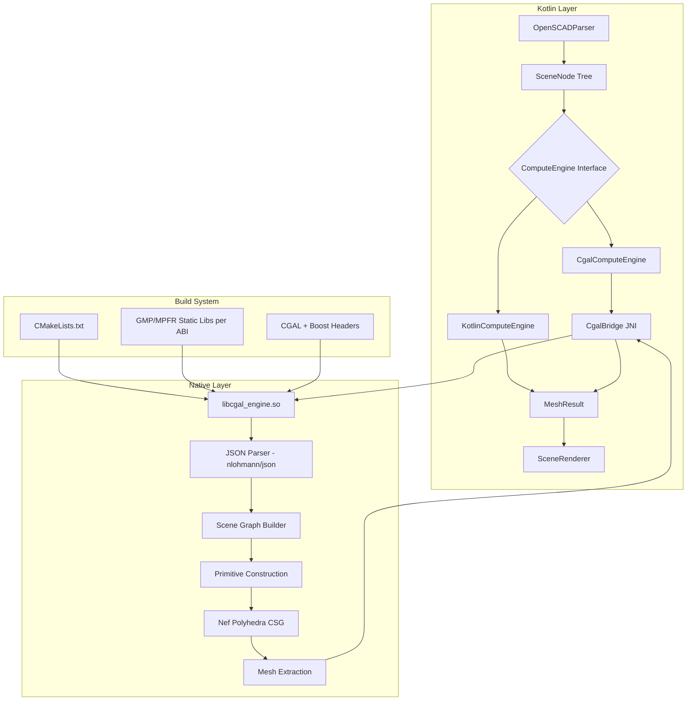
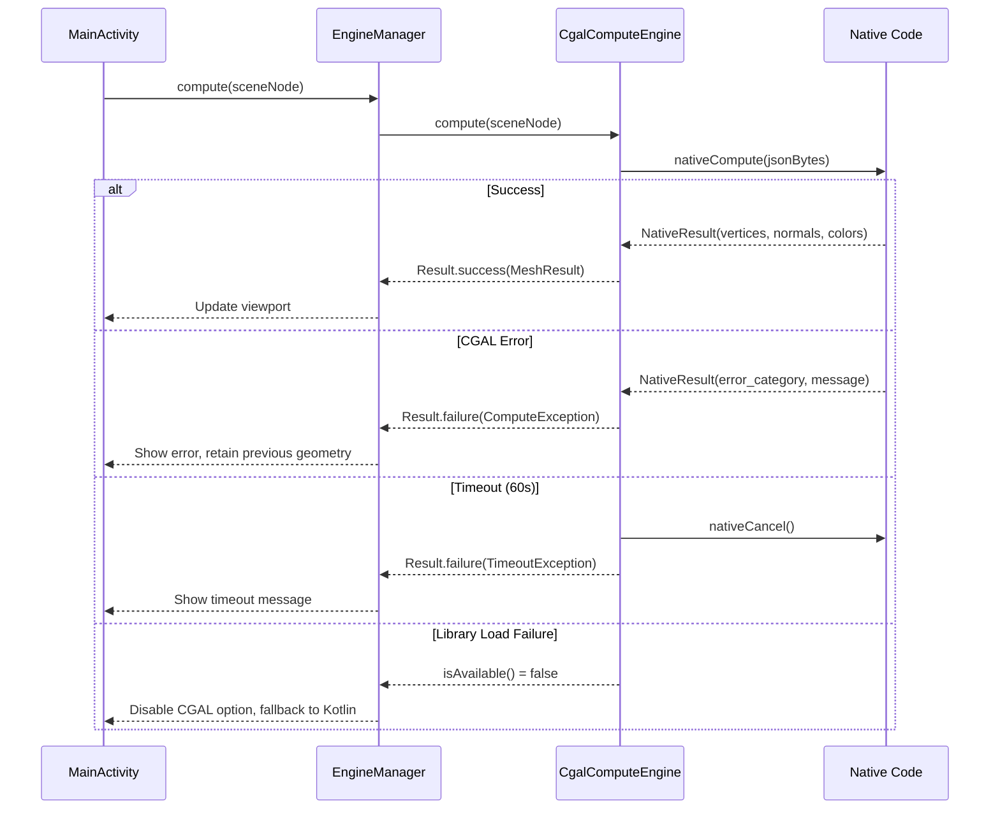

# Design Document: CGAL Compute Engine

## Overview

This design introduces a CGAL-based native compute engine as an alternative mesh generation backend for the OpenSCAD Viewer app. The current pure-Kotlin `MeshGenerator` renders CSG operations (difference, intersection) incorrectly — it simply draws all children without computing Boolean geometry. The CGAL engine solves this by using exact-arithmetic Nef polyhedra for precise CSG computation.

The architecture introduces a `ComputeEngine` interface that abstracts mesh generation, allowing the rendering layer to remain decoupled from the engine implementation. A JNI bridge serializes the Kotlin scene graph as JSON and passes it to native C++ code where CGAL performs exact Boolean operations. Results are returned as flat float arrays ready for OpenGL consumption.

Key design decisions:
- **CGAL as header-only**: Since CGAL 5.0, the library is header-only. Only GMP and MPFR require pre-compiled static libraries per ABI.
- **JSON serialization for JNI**: Scene graphs are serialized to JSON byte arrays to cross the JNI boundary, avoiding complex JNI object marshalling.
- **Nef polyhedra for CSG**: CGAL's `Nef_polyhedron_3` with `Exact_predicates_exact_constructions_kernel` provides mathematically correct Boolean operations.
- **Cancellation via atomic flag**: Long-running CGAL computations are cancellable through a shared atomic boolean checked at operation boundaries.

## Architecture



### Data Flow

1. User edits OpenSCAD code → `OpenSCADParser.parse()` → `SceneNode` tree
2. `ComputeEngine.compute(sceneNode)` is called
3. If CGAL engine is selected:
   - `CgalComputeEngine` serializes `SceneNode` tree to JSON
   - JSON byte array crosses JNI boundary to native code
   - Native code reconstructs scene graph, builds CGAL Nef polyhedra
   - CSG operations are applied using exact Boolean operations
   - Result is converted to triangle mesh → float arrays returned via JNI
4. `MeshResult` (vertices, normals, colors) is passed to `SceneRenderer.setMeshData()`

## Components and Interfaces

### ComputeEngine Interface

```kotlin
package com.openscadviewer.engine

import com.openscadviewer.parser.SceneNode

/**
 * Result of mesh generation containing OpenGL-ready float arrays.
 */
data class MeshResult(
    val vertices: FloatArray,   // x,y,z triplets
    val normals: FloatArray,    // nx,ny,nz triplets
    val colors: FloatArray      // r,g,b,a quads
) {
    val vertexCount: Int get() = vertices.size / 3
    val triangleCount: Int get() = vertices.size / 9

    companion object {
        val EMPTY = MeshResult(FloatArray(0), FloatArray(0), FloatArray(0))
    }
}

/**
 * Error descriptor returned when a compute engine fails.
 */
data class ComputeError(
    val category: ErrorCategory,
    val message: String
)

enum class ErrorCategory {
    INVALID_INPUT,
    COMPUTATION_FAILURE,
    OUT_OF_MEMORY,
    TIMEOUT,
    CANCELLED
}

/**
 * Common interface for mesh generation engines.
 * The rendering layer uses only this interface.
 */
interface ComputeEngine {
    /**
     * Compute triangle mesh from scene graph.
     * @param scene Root node of the parsed scene graph
     * @return Result containing either mesh data or error
     */
    suspend fun compute(scene: SceneNode): Result<MeshResult>

    /**
     * Cancel any in-progress computation.
     */
    fun cancel()

    /**
     * Check if this engine is available on the current device.
     */
    fun isAvailable(): Boolean
}
```

### KotlinComputeEngine

Wraps the existing `MeshGenerator` behind the `ComputeEngine` interface:

```kotlin
package com.openscadviewer.engine

import com.openscadviewer.parser.SceneNode
import com.openscadviewer.renderer.MeshGenerator

class KotlinComputeEngine : ComputeEngine {
    private val meshGenerator = MeshGenerator()
    @Volatile private var cancelled = false

    override suspend fun compute(scene: SceneNode): Result<MeshResult> {
        cancelled = false
        return try {
            val mesh = meshGenerator.generate(scene)
            if (cancelled) {
                Result.success(MeshResult.EMPTY)
            } else {
                Result.success(MeshResult(mesh.vertices, mesh.normals, mesh.colors))
            }
        } catch (e: Exception) {
            Result.failure(e)
        }
    }

    override fun cancel() { cancelled = true }
    override fun isAvailable(): Boolean = true
}
```

### CgalComputeEngine

Delegates computation to native code via JNI:

```kotlin
package com.openscadviewer.engine

import com.openscadviewer.parser.SceneNode
import kotlinx.coroutines.Dispatchers
import kotlinx.coroutines.withContext
import kotlinx.coroutines.withTimeoutOrNull

class CgalComputeEngine : ComputeEngine {
    private var nativeHandle: Long = 0
    private var libraryLoaded = false

    override suspend fun compute(scene: SceneNode): Result<MeshResult> {
        if (!isAvailable()) {
            return Result.failure(
                IllegalStateException("CGAL native library not available")
            )
        }

        val json = SceneSerializer.toJson(scene)
        val jsonBytes = json.toByteArray(Charsets.UTF_8)

        return withContext(Dispatchers.Default) {
            val result = withTimeoutOrNull(60_000L) {
                nativeCompute(jsonBytes)
            }

            if (result == null) {
                nativeCancel(nativeHandle)
                Result.failure(ComputeException(
                    ComputeError(ErrorCategory.TIMEOUT, "Computation exceeded 60 seconds")
                ))
            } else if (result.errorCategory != null) {
                Result.failure(ComputeException(
                    ComputeError(
                        ErrorCategory.valueOf(result.errorCategory),
                        result.errorMessage ?: "Unknown error"
                    )
                ))
            } else {
                Result.success(MeshResult(
                    result.vertices ?: FloatArray(0),
                    result.normals ?: FloatArray(0),
                    result.colors ?: FloatArray(0)
                ))
            }
        }
    }

    override fun cancel() {
        if (nativeHandle != 0L) {
            nativeCancel(nativeHandle)
        }
    }

    override fun isAvailable(): Boolean {
        if (!libraryLoaded) {
            libraryLoaded = try {
                System.loadLibrary("cgal_engine")
                true
            } catch (e: UnsatisfiedLinkError) {
                false
            }
        }
        return libraryLoaded
    }

    // JNI native methods
    private external fun nativeCompute(sceneJson: ByteArray): NativeResult
    private external fun nativeCancel(handle: Long)
}

/**
 * JNI result wrapper returned from native code.
 */
data class NativeResult(
    val vertices: FloatArray?,
    val normals: FloatArray?,
    val colors: FloatArray?,
    val errorCategory: String?,
    val errorMessage: String?
)

class ComputeException(val error: ComputeError) : Exception(error.message)
```

### SceneSerializer

Converts `SceneNode` tree to JSON for JNI transport:

```kotlin
package com.openscadviewer.engine

import com.openscadviewer.parser.SceneNode
import org.json.JSONArray
import org.json.JSONObject

object SceneSerializer {
    fun toJson(node: SceneNode): String {
        return nodeToJson(node).toString()
    }

    private fun nodeToJson(node: SceneNode): JSONObject {
        val obj = JSONObject()
        when (node) {
            is SceneNode.Cube -> {
                obj.put("type", "cube")
                obj.put("sizeX", node.sizeX)
                obj.put("sizeY", node.sizeY)
                obj.put("sizeZ", node.sizeZ)
                obj.put("center", node.center)
            }
            is SceneNode.Sphere -> {
                obj.put("type", "sphere")
                obj.put("radius", node.radius)
                obj.put("segments", node.segments)
            }
            is SceneNode.Cylinder -> {
                obj.put("type", "cylinder")
                obj.put("height", node.height)
                obj.put("radius1", node.radius1)
                obj.put("radius2", node.radius2)
                obj.put("center", node.center)
                obj.put("segments", node.segments)
            }
            is SceneNode.LinearExtrude -> {
                obj.put("type", "linear_extrude")
                obj.put("height", node.height)
                obj.put("child", nodeToJson(node.child))
            }
            is SceneNode.Circle -> {
                obj.put("type", "circle")
                obj.put("radius", node.radius)
                obj.put("segments", node.segments)
            }
            is SceneNode.Square -> {
                obj.put("type", "square")
                obj.put("sizeX", node.sizeX)
                obj.put("sizeY", node.sizeY)
                obj.put("center", node.center)
            }
            is SceneNode.Polygon -> {
                obj.put("type", "polygon")
                val pts = JSONArray()
                for (p in node.points) {
                    val pt = JSONArray()
                    pt.put(p.first)
                    pt.put(p.second)
                    pts.put(pt)
                }
                obj.put("points", pts)
            }
            is SceneNode.Translate -> {
                obj.put("type", "translate")
                obj.put("x", node.x)
                obj.put("y", node.y)
                obj.put("z", node.z)
                obj.put("child", nodeToJson(node.child))
            }
            is SceneNode.Rotate -> {
                obj.put("type", "rotate")
                obj.put("x", node.x)
                obj.put("y", node.y)
                obj.put("z", node.z)
                obj.put("child", nodeToJson(node.child))
            }
            is SceneNode.Scale -> {
                obj.put("type", "scale")
                obj.put("x", node.x)
                obj.put("y", node.y)
                obj.put("z", node.z)
                obj.put("child", nodeToJson(node.child))
            }
            is SceneNode.Color -> {
                obj.put("type", "color")
                obj.put("r", node.r.toDouble())
                obj.put("g", node.g.toDouble())
                obj.put("b", node.b.toDouble())
                obj.put("a", node.a.toDouble())
                obj.put("child", nodeToJson(node.child))
            }
            is SceneNode.Union -> {
                obj.put("type", "union")
                obj.put("children", childrenToJson(node.children))
            }
            is SceneNode.Difference -> {
                obj.put("type", "difference")
                obj.put("children", childrenToJson(node.children))
            }
            is SceneNode.Intersection -> {
                obj.put("type", "intersection")
                obj.put("children", childrenToJson(node.children))
            }
            is SceneNode.Group -> {
                obj.put("type", "group")
                obj.put("children", childrenToJson(node.children))
            }
        }
        return obj
    }

    private fun childrenToJson(children: List<SceneNode>): JSONArray {
        val arr = JSONArray()
        for (child in children) {
            arr.put(nodeToJson(child))
        }
        return arr
    }
}
```

### EngineManager

Manages engine selection and persistence:

```kotlin
package com.openscadviewer.engine

import android.content.Context
import android.content.SharedPreferences

enum class EngineType {
    KOTLIN,
    CGAL
}

class EngineManager(context: Context) {
    private val prefs: SharedPreferences =
        context.getSharedPreferences("engine_prefs", Context.MODE_PRIVATE)

    private val kotlinEngine = KotlinComputeEngine()
    private val cgalEngine = CgalComputeEngine()

    var selectedType: EngineType
        get() {
            val stored = prefs.getString("engine_type", "KOTLIN")
            return EngineType.valueOf(stored ?: "KOTLIN")
        }
        set(value) {
            prefs.edit().putString("engine_type", value.name).apply()
        }

    val currentEngine: ComputeEngine
        get() = when (selectedType) {
            EngineType.KOTLIN -> kotlinEngine
            EngineType.CGAL -> {
                if (cgalEngine.isAvailable()) cgalEngine else kotlinEngine
            }
        }

    fun isCgalAvailable(): Boolean = cgalEngine.isAvailable()
}
```

### Native C++ Components

#### cgal_engine.cpp (JNI entry point)

```cpp
#include <jni.h>
#include <string>
#include <atomic>
#include "nlohmann/json.hpp"
#include "scene_builder.h"
#include "cgal_compute.h"

using json = nlohmann::json;

static std::atomic<bool> g_cancel_flag{false};

extern "C" JNIEXPORT jobject JNICALL
Java_com_openscadviewer_engine_CgalComputeEngine_nativeCompute(
    JNIEnv* env, jobject thiz, jbyteArray sceneJson) {

    g_cancel_flag.store(false);

    // Extract JSON bytes
    jsize len = env->GetArrayLength(sceneJson);
    jbyte* bytes = env->GetByteArrayElements(sceneJson, nullptr);
    std::string jsonStr(reinterpret_cast<char*>(bytes), len);
    env->ReleaseByteArrayElements(sceneJson, bytes, JNI_ABORT);

    // Parse and compute
    try {
        json sceneData = json::parse(jsonStr);
        auto result = cgal_compute(sceneData, g_cancel_flag);

        // Build NativeResult object and return
        return build_native_result(env, result);
    } catch (const std::exception& e) {
        return build_error_result(env, "computation_failure", e.what());
    }
}

extern "C" JNIEXPORT void JNICALL
Java_com_openscadviewer_engine_CgalComputeEngine_nativeCancel(
    JNIEnv* env, jobject thiz, jlong handle) {
    g_cancel_flag.store(true);
}
```

#### cgal_compute.h (Core CGAL logic)

```cpp
#pragma once
#include <CGAL/Exact_predicates_exact_constructions_kernel.h>
#include <CGAL/Nef_polyhedron_3.h>
#include <CGAL/Polyhedron_3.h>
#include <CGAL/convex_hull_3.h>
#include <CGAL/Polygon_mesh_processing/triangulate_faces.h>
#include <CGAL/Aff_transformation_3.h>
#include "nlohmann/json.hpp"
#include <atomic>
#include <vector>

using Kernel = CGAL::Exact_predicates_exact_constructions_kernel;
using Point_3 = Kernel::Point_3;
using Polyhedron = CGAL::Polyhedron_3<Kernel>;
using Nef_polyhedron = CGAL::Nef_polyhedron_3<Kernel>;
using Aff_transformation = CGAL::Aff_transformation_3<Kernel>;

struct ComputeResult {
    std::vector<float> vertices;
    std::vector<float> normals;
    std::vector<float> colors;
    std::string error_category;
    std::string error_message;
};

ComputeResult cgal_compute(const nlohmann::json& scene,
                           std::atomic<bool>& cancel_flag);
```

## Data Models

### Scene Graph JSON Schema

The `SceneNode` tree is serialized to JSON for JNI transport. Each node has a `type` field and type-specific parameters:

```json
{
  "type": "difference",
  "children": [
    {
      "type": "cube",
      "sizeX": 30.0,
      "sizeY": 30.0,
      "sizeZ": 30.0,
      "center": true
    },
    {
      "type": "sphere",
      "radius": 18.0,
      "segments": 32
    }
  ]
}
```

### MeshResult Data Layout

| Field    | Format                  | Description                         |
|----------|-------------------------|-------------------------------------|
| vertices | `[x,y,z, x,y,z, ...]`  | Triangle vertex positions           |
| normals  | `[nx,ny,nz, ...]`      | Per-vertex normals                  |
| colors   | `[r,g,b,a, r,g,b,a, ...]` | Per-vertex RGBA colors           |

Invariants:
- `vertices.size == normals.size`
- `colors.size == (vertices.size / 3) * 4`
- `vertices.size % 9 == 0` (complete triangles only)

### NativeResult JNI Object

Returned from C++ to Kotlin with either mesh data or error information:

```
NativeResult {
    vertices: FloatArray?       // null on error
    normals: FloatArray?        // null on error
    colors: FloatArray?         // null on error
    errorCategory: String?      // null on success
    errorMessage: String?       // null on success, max 256 chars
}
```

### Engine Preference Storage

SharedPreferences key-value:
- Key: `"engine_type"`
- Values: `"KOTLIN"` | `"CGAL"`
- Default: `"KOTLIN"`

### Build Artifact Layout

```
app/
├── src/main/
│   ├── cpp/
│   │   ├── CMakeLists.txt
│   │   ├── cgal_engine.cpp          # JNI entry point
│   │   ├── cgal_compute.cpp         # CGAL CSG logic
│   │   ├── cgal_compute.h
│   │   ├── scene_builder.cpp        # JSON → CGAL primitives
│   │   ├── scene_builder.h
│   │   ├── mesh_extractor.cpp       # Nef → triangle mesh
│   │   ├── mesh_extractor.h
│   │   └── include/
│   │       └── nlohmann/
│   │           └── json.hpp          # Single-header JSON lib
│   └── java/com/openscadviewer/
│       └── engine/
│           ├── ComputeEngine.kt
│           ├── KotlinComputeEngine.kt
│           ├── CgalComputeEngine.kt
│           ├── SceneSerializer.kt
│           ├── EngineManager.kt
│           └── NativeResult.kt
├── vendor/
│   ├── cgal/                         # CGAL headers (header-only)
│   │   └── include/
│   ├── boost/                        # Boost headers (header-only subset)
│   │   └── include/
│   ├── gmp/
│   │   ├── include/
│   │   │   └── gmp.h
│   │   └── lib/
│   │       ├── arm64-v8a/
│   │       │   └── libgmp.a
│   │       ├── armeabi-v7a/
│   │       │   └── libgmp.a
│   │       └── x86_64/
│   │           └── libgmp.a
│   └── mpfr/
│       ├── include/
│       │   └── mpfr.h
│       └── lib/
│           ├── arm64-v8a/
│           │   └── libmpfr.a
│           ├── armeabi-v7a/
│           │   └── libmpfr.a
│           └── x86_64/
│               └── libmpfr.a
└── build.gradle.kts                  # Updated with externalNativeBuild
```

### CMakeLists.txt Structure

```cmake
cmake_minimum_required(VERSION 3.22)
project(cgal_engine CXX)

set(CMAKE_CXX_STANDARD 17)
set(CMAKE_CXX_STANDARD_REQUIRED ON)

# CGAL header-only
add_definitions(-DCGAL_HEADER_ONLY)
include_directories(
    ${CMAKE_SOURCE_DIR}/../../vendor/cgal/include
    ${CMAKE_SOURCE_DIR}/../../vendor/boost/include
    ${CMAKE_SOURCE_DIR}/../../vendor/gmp/include
    ${CMAKE_SOURCE_DIR}/../../vendor/mpfr/include
    ${CMAKE_SOURCE_DIR}/include
)

# GMP and MPFR static libraries per ABI
set(VENDOR_LIB_DIR ${CMAKE_SOURCE_DIR}/../../vendor)
find_library(GMP_LIB gmp PATHS
    ${VENDOR_LIB_DIR}/gmp/lib/${ANDROID_ABI} NO_DEFAULT_PATH)
find_library(MPFR_LIB mpfr PATHS
    ${VENDOR_LIB_DIR}/mpfr/lib/${ANDROID_ABI} NO_DEFAULT_PATH)

# Native shared library
add_library(cgal_engine SHARED
    cgal_engine.cpp
    cgal_compute.cpp
    scene_builder.cpp
    mesh_extractor.cpp
)

target_link_libraries(cgal_engine
    ${GMP_LIB}
    ${MPFR_LIB}
    log
)
```


## Correctness Properties

*A property is a characteristic or behavior that should hold true across all valid executions of a system — essentially, a formal statement about what the system should do. Properties serve as the bridge between human-readable specifications and machine-verifiable correctness guarantees.*

### Property 1: Mesh output structural invariants

*For any* valid `SceneNode` tree that produces a non-empty mesh result, the output arrays SHALL satisfy: `vertices.size % 9 == 0` (complete triangles), `normals.size == vertices.size`, and `colors.size == (vertices.size / 3) * 4`.

**Validates: Requirements 1.1, 4.5**

### Property 2: Empty scene graph produces empty result

*For any* `SceneNode` tree that contains no geometry-producing leaf nodes (only Group, Translate, Rotate, Scale nodes wrapping no primitives), both the Kotlin engine and CGAL engine SHALL return a `MeshResult` with zero vertices.

**Validates: Requirements 1.5**

### Property 3: Engine preference persistence round-trip

*For any* `EngineType` value, storing it via `EngineManager.selectedType` and then reading it back SHALL return the same `EngineType` value.

**Validates: Requirements 2.2**

### Property 4: Scene graph serialization round-trip

*For any* valid `SceneNode` tree, serializing it to JSON via `SceneSerializer.toJson()` and deserializing it back SHALL produce a structurally equivalent `SceneNode` tree (same node types, same parameter values within floating-point tolerance).

**Validates: Requirements 4.1**

### Property 5: Degenerate primitives excluded from computation

*For any* scene graph containing a mix of valid primitives (positive dimensions) and degenerate primitives (zero or negative size/radius/height), the compute result SHALL contain geometry only from the valid primitives, and the degenerate primitives SHALL not cause a computation failure.

**Validates: Requirements 4.8, 5.7**

### Property 6: Boolean difference reduces volume

*For any* two non-degenerate overlapping solids A and B where both have non-zero volume and their intersection has non-zero volume, computing `difference(A, B)` SHALL produce a mesh whose enclosed volume is strictly less than the volume of A alone.

**Validates: Requirements 5.1**

### Property 7: Boolean union volume bound

*For any* set of non-degenerate solids, the volume enclosed by their Boolean union SHALL be less than or equal to the sum of their individual volumes.

**Validates: Requirements 5.2**

### Property 8: Boolean intersection volume bound

*For any* two non-degenerate overlapping solids A and B, the volume enclosed by their Boolean intersection SHALL be less than or equal to the minimum of volume(A) and volume(B).

**Validates: Requirements 5.3**

### Property 9: Watertight mesh output for non-empty CSG results

*For any* CSG operation that produces a non-empty mesh result (non-zero vertex count), every edge in the triangle mesh SHALL be shared by exactly two triangles with consistent winding order (manifold property).

**Validates: Requirements 5.4**

## Error Handling

### Error Categories

| Category | Source | Response |
|----------|--------|----------|
| `INVALID_INPUT` | Malformed JSON, invalid node structure | Return error to Kotlin, display message |
| `COMPUTATION_FAILURE` | CGAL internal error, numerical issue | Return error, retain last valid geometry |
| `OUT_OF_MEMORY` | Excessive mesh complexity | Return error, suggest simpler model |
| `TIMEOUT` | Computation exceeds 60s | Cancel via atomic flag, return timeout error |
| `CANCELLED` | User presses cancel | Terminate via atomic flag, restore previous state |

### Error Flow



### Native Cancellation Mechanism

The native code checks a `std::atomic<bool>` flag at key points:
- Before each CSG operation
- Between primitive construction steps
- During mesh extraction

When the flag is set, the native code throws a `CancelledException` that propagates back through JNI as an error result with category `CANCELLED`.

### Resource Cleanup

- On timeout or cancellation, JNI `nativeCancel()` sets the atomic flag
- Native code detects the flag and cleans up CGAL objects via RAII (stack-allocated Nef polyhedra are automatically destroyed)
- On library load failure, no native resources are allocated — `isAvailable()` returns false and all subsequent calls short-circuit

## Testing Strategy

### Unit Tests (Kotlin)

- **SceneSerializer**: Verify JSON output for each `SceneNode` type
- **EngineManager**: Verify engine selection, persistence, fallback logic
- **KotlinComputeEngine**: Verify it produces the same output as direct `MeshGenerator` usage
- **MeshResult invariants**: Verify array size relationships

### Property-Based Tests (Kotlin + JUnit5 + jqwik)

The project will use **jqwik** (JUnit5 property-based testing engine for JVM) to implement property tests.

Configuration:
- Minimum 100 iterations per property test
- Custom `SceneNode` generators for random tree construction
- Tag format: `Feature: cgal-compute-engine, Property {N}: {title}`

Properties to implement:
1. Mesh output structural invariants (Property 1)
2. Empty scene graph → empty result (Property 2)
3. Engine preference round-trip (Property 3)
4. Serialization round-trip (Property 4)
5. Degenerate primitives excluded (Property 5)

Properties 6–9 (volume bounds, watertight mesh) require the native CGAL library and will be implemented as integration-property tests that run on a device/emulator with the native library available.

### Integration Tests (Android Instrumented)

- CGAL engine produces correct output for known models (cube, sphere, cube-minus-sphere)
- JNI bridge handles large scene graphs without crashing
- Timeout mechanism fires correctly for complex models
- Cancellation terminates native computation within reasonable time
- Library load failure triggers correct fallback behavior

### Build Verification Tests

- Gradle assemble produces .so files for all configured ABIs
- APK contains native libraries in correct paths
- CMake configuration resolves all header dependencies
