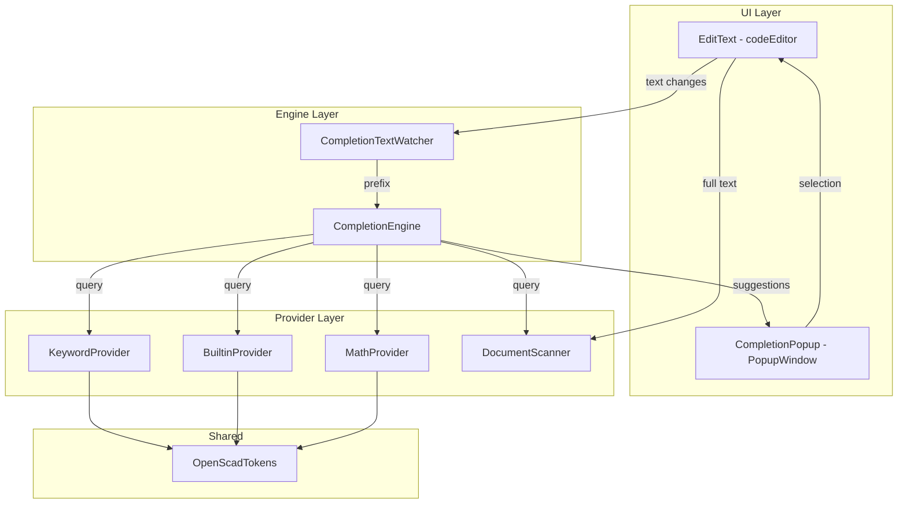
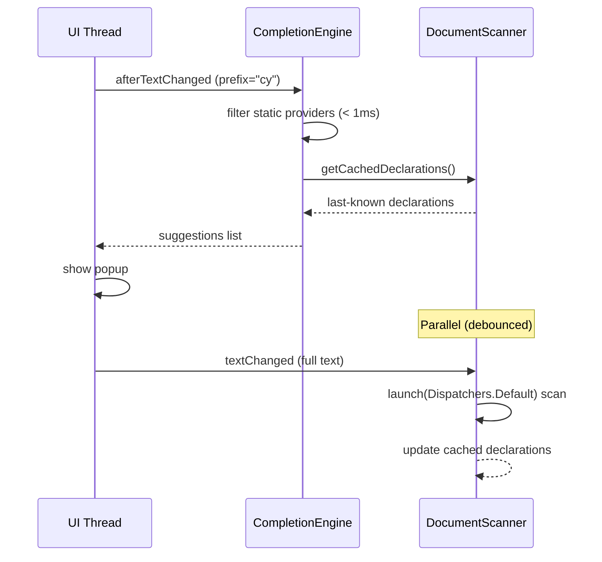

# Design Document: Editor Code Completion

## Overview

This design describes the code completion system for the OpenSCAD editor in the Pncad Android app. The system provides autocomplete suggestions as the user types, covering OpenSCAD keywords, built-in modules/functions, math functions, and user-defined declarations extracted from the current document.

The architecture follows a provider-based pattern where multiple `CompletionProvider` implementations supply candidates, and a central `CompletionEngine` aggregates, deduplicates, and filters them against the current prefix. A `CompletionPopup` renders the filtered suggestions using a `PopupWindow` anchored near the cursor position. The `DocumentScanner` runs on a background coroutine to extract user-defined names without blocking the UI thread.

Key design decisions:
- **PopupWindow over AutoCompleteTextView**: The EditText is nested inside ScrollView > HorizontalScrollView, which breaks AutoCompleteTextView's built-in dropdown positioning. A manual PopupWindow gives full control over anchor calculation.
- **Shared token lists with SyntaxHighlighter**: The keyword/builtin/math lists already exist in `SyntaxHighlighter.companion`. We extract them into a shared `OpenScadTokens` object to avoid duplication.
- **Coroutine-based scanning**: The `DocumentScanner` uses `Dispatchers.Default` with debouncing (500ms) to re-scan the document after edits without blocking input.
- **Single TextWatcher integration**: A new `CompletionTextWatcher` coordinates with the existing line-number TextWatcher; it extracts the prefix and triggers the engine.

## Architecture



### Data Flow

1. User types a character → `CompletionTextWatcher.afterTextChanged()` fires
2. TextWatcher extracts the prefix (word characters behind cursor)
3. If prefix length < 2, dismiss popup and return
4. `CompletionEngine.complete(prefix)` queries all providers
5. Results are merged with priority ordering, deduplicated, and capped
6. If results are non-empty, `CompletionPopup.show(suggestions, anchorPosition)` displays them
7. If results are empty, `CompletionPopup.dismiss()`
8. User taps a suggestion → `CompletionPopup` fires selection callback
9. Callback replaces prefix with selected text atomically (single undo step)

### Threading Model



## Components and Interfaces

### OpenScadTokens (Shared Object)

```kotlin
package com.openscadviewer.editor

object OpenScadTokens {
    val KEYWORDS: List<String> = listOf(
        "module", "function", "if", "else", "for", "let",
        "each", "assert", "echo", "include", "use"
    )

    val BUILTINS: List<String> = listOf(
        "cube", "sphere", "cylinder", "polyhedron",
        "circle", "square", "polygon", "text",
        "translate", "rotate", "scale", "mirror", "multmatrix",
        "color", "offset", "hull", "minkowski",
        "union", "difference", "intersection",
        "linear_extrude", "rotate_extrude",
        "import", "surface", "projection",
        "render", "children"
    )

    val MATH_FUNCTIONS: List<String> = listOf(
        "abs", "sign", "sin", "cos", "tan", "asin", "acos", "atan", "atan2",
        "floor", "ceil", "round", "sqrt", "pow", "exp", "log", "ln",
        "min", "max", "len", "norm", "cross", "concat", "lookup", "str"
    )
}
```

### CompletionProvider (Interface)

```kotlin
package com.openscadviewer.editor

interface CompletionProvider {
    /** Provider category for priority ordering */
    val category: CompletionCategory

    /**
     * Returns candidates matching the given prefix (case-insensitive prefix match).
     * Results are sorted alphabetically.
     */
    fun complete(prefix: String): List<String>
}

enum class CompletionCategory(val priority: Int) {
    USER_DEFINED(0),
    KEYWORD(1),
    BUILTIN(2),
    MATH(3)
}
```

### KeywordProvider

```kotlin
package com.openscadviewer.editor

class KeywordProvider : CompletionProvider {
    override val category = CompletionCategory.KEYWORD

    private val keywords = OpenScadTokens.KEYWORDS.sorted()

    override fun complete(prefix: String): List<String> {
        val lowerPrefix = prefix.lowercase()
        return keywords.filter { it.lowercase().startsWith(lowerPrefix) }
    }
}
```

### BuiltinProvider

```kotlin
package com.openscadviewer.editor

class BuiltinProvider : CompletionProvider {
    override val category = CompletionCategory.BUILTIN

    private val builtins = OpenScadTokens.BUILTINS.sorted()

    override fun complete(prefix: String): List<String> {
        val lowerPrefix = prefix.lowercase()
        return builtins.filter { it.lowercase().startsWith(lowerPrefix) }
    }
}
```

### MathProvider

```kotlin
package com.openscadviewer.editor

class MathProvider : CompletionProvider {
    override val category = CompletionCategory.MATH

    private val mathFunctions = OpenScadTokens.MATH_FUNCTIONS.sorted()

    override fun complete(prefix: String): List<String> {
        val lowerPrefix = prefix.lowercase()
        return mathFunctions.filter { it.lowercase().startsWith(lowerPrefix) }
    }
}
```

### DocumentScanner

```kotlin
package com.openscadviewer.editor

import kotlinx.coroutines.*

class DocumentScanner(
    private val scope: CoroutineScope,
    private val dispatcher: CoroutineDispatcher = Dispatchers.Default
) : CompletionProvider {
    override val category = CompletionCategory.USER_DEFINED

    @Volatile
    private var cachedDeclarations: List<String> = emptyList()

    private var scanJob: Job? = null

    companion object {
        private val DECLARATION_PATTERN = Regex(
            """(?:module|function)\s+([a-zA-Z_][a-zA-Z0-9_]*)\s*\("""
        )
        private val LINE_COMMENT_PATTERN = Regex("""//[^\n]*""")
        private val BLOCK_COMMENT_PATTERN = Regex("""/\*.*?\*/""", RegexOption.DOT_MATCHES_ALL)
    }

    /**
     * Triggers a debounced re-scan of the document text.
     * Cancels any in-progress scan and starts a new one after 500ms.
     */
    fun onTextChanged(text: String) {
        scanJob?.cancel()
        scanJob = scope.launch(dispatcher) {
            delay(500)
            val declarations = scan(text)
            cachedDeclarations = declarations
        }
    }

    override fun complete(prefix: String): List<String> {
        val lowerPrefix = prefix.lowercase()
        return cachedDeclarations.filter { it.lowercase().startsWith(lowerPrefix) }
    }

    /**
     * Extracts user-defined module/function names from text,
     * excluding those inside comments.
     */
    internal fun scan(text: String): List<String> {
        // Remove comments first
        val stripped = text
            .replace(BLOCK_COMMENT_PATTERN, { " ".repeat(it.value.length) })
            .replace(LINE_COMMENT_PATTERN, { " ".repeat(it.value.length) })

        // Extract declarations
        val names = mutableSetOf<String>()
        DECLARATION_PATTERN.findAll(stripped).forEach { match ->
            names.add(match.groupValues[1])
        }
        return names.sorted().toList()
    }
}
```

### CompletionEngine

```kotlin
package com.openscadviewer.editor

class CompletionEngine(
    private val providers: List<CompletionProvider>
) {
    companion object {
        const val MIN_PREFIX_LENGTH = 2
    }

    /**
     * Returns filtered, deduplicated, priority-ordered suggestions.
     * Returns empty list if prefix is shorter than MIN_PREFIX_LENGTH.
     */
    fun complete(prefix: String): List<CompletionItem> {
        if (prefix.length < MIN_PREFIX_LENGTH) return emptyList()

        val seen = mutableSetOf<String>()
        val results = mutableListOf<CompletionItem>()

        // Providers are pre-sorted by category priority
        for (provider in providers.sortedBy { it.category.priority }) {
            val candidates = provider.complete(prefix)
            for (candidate in candidates) {
                val lower = candidate.lowercase()
                if (lower !in seen) {
                    seen.add(lower)
                    results.add(CompletionItem(candidate, provider.category))
                }
            }
        }
        return results
    }
}

data class CompletionItem(
    val text: String,
    val category: CompletionCategory
)
```

### CompletionPopup

```kotlin
package com.openscadviewer.editor

import android.content.Context
import android.graphics.Color
import android.graphics.Typeface
import android.util.TypedValue
import android.view.Gravity
import android.view.ViewGroup
import android.widget.LinearLayout
import android.widget.PopupWindow
import android.widget.ScrollView
import android.widget.TextView
import android.widget.EditText

class CompletionPopup(
    private val context: Context,
    private val anchorView: EditText,
    private val onItemSelected: (CompletionItem) -> Unit
) {
    companion object {
        const val MAX_VISIBLE_ITEMS = 5
        private const val BACKGROUND_COLOR = 0xFF1E1E1E.toInt()
        private const val TEXT_COLOR = 0xFFD4D4D4.toInt()
        private const val HIGHLIGHT_COLOR = 0xFF264F78.toInt()
        private const val TEXT_SIZE_SP = 13f
        private const val ITEM_PADDING_DP = 8
    }

    private var popupWindow: PopupWindow? = null
    private var isShowing = false

    fun show(items: List<CompletionItem>, cursorLine: Int, cursorCol: Int) {
        dismiss()
        if (items.isEmpty()) return

        val contentView = buildContentView(items)
        val popup = PopupWindow(
            contentView,
            ViewGroup.LayoutParams.WRAP_CONTENT,
            ViewGroup.LayoutParams.WRAP_CONTENT,
            false  // not focusable - let EditText keep focus
        )
        popup.isOutsideTouchable = true
        popup.setOnDismissListener { isShowing = false }

        // Calculate anchor position based on cursor coordinates
        val (x, y) = calculatePosition(cursorLine, cursorCol)
        popup.showAtLocation(anchorView, Gravity.NO_GRAVITY, x, y)

        popupWindow = popup
        isShowing = true
    }

    fun dismiss() {
        popupWindow?.dismiss()
        popupWindow = null
        isShowing = false
    }

    fun isShowing(): Boolean = isShowing

    fun update(items: List<CompletionItem>, cursorLine: Int, cursorCol: Int) {
        if (items.isEmpty()) {
            dismiss()
        } else {
            show(items, cursorLine, cursorCol)
        }
    }

    private fun calculatePosition(cursorLine: Int, cursorCol: Int): Pair<Int, Int> {
        val layout = anchorView.layout ?: return Pair(0, 0)
        val lineTop = layout.getLineTop(cursorLine)
        val lineBottom = layout.getLineBottom(cursorLine)
        val x = layout.getPrimaryHorizontal(
            anchorView.text.let {
                var pos = 0
                for (i in 0 until cursorLine) pos = layout.getLineEnd(i)
                pos + cursorCol
            }
        ).toInt()

        // Get EditText location on screen
        val location = IntArray(2)
        anchorView.getLocationOnScreen(location)

        val screenY = location[1] + lineBottom - anchorView.scrollY
        val screenX = location[0] + x - anchorView.scrollX

        return Pair(screenX, screenY)
    }

    private fun buildContentView(items: List<CompletionItem>): ScrollView {
        val scrollView = ScrollView(context).apply {
            isVerticalScrollBarEnabled = items.size > MAX_VISIBLE_ITEMS
        }
        val container = LinearLayout(context).apply {
            orientation = LinearLayout.VERTICAL
            setBackgroundColor(BACKGROUND_COLOR)
        }

        for (item in items) {
            val textView = TextView(context).apply {
                text = item.text
                typeface = Typeface.MONOSPACE
                setTextSize(TypedValue.COMPLEX_UNIT_SP, TEXT_SIZE_SP)
                setTextColor(TEXT_COLOR)
                val pad = dpToPx(ITEM_PADDING_DP)
                setPadding(pad * 2, pad, pad * 2, pad)
                setOnClickListener { onItemSelected(item) }
            }
            container.addView(textView)
        }

        scrollView.addView(container)
        return scrollView
    }

    private fun dpToPx(dp: Int): Int {
        return TypedValue.applyDimension(
            TypedValue.COMPLEX_UNIT_DIP,
            dp.toFloat(),
            context.resources.displayMetrics
        ).toInt()
    }
}
```

### CompletionTextWatcher

```kotlin
package com.openscadviewer.editor

import android.text.Editable
import android.text.TextWatcher
import android.widget.EditText

class CompletionTextWatcher(
    private val editText: EditText,
    private val engine: CompletionEngine,
    private val popup: CompletionPopup,
    private val documentScanner: DocumentScanner
) : TextWatcher {

    companion object {
        private val WORD_CHAR_PATTERN = Regex("[a-zA-Z_][a-zA-Z0-9_]*$")
    }

    private var isInserting = false

    override fun beforeTextChanged(s: CharSequence?, start: Int, count: Int, after: Int) {}
    override fun onTextChanged(s: CharSequence?, start: Int, before: Int, count: Int) {}

    override fun afterTextChanged(s: Editable?) {
        if (isInserting) return
        val text = s?.toString() ?: return

        // Trigger document scanner (debounced)
        documentScanner.onTextChanged(text)

        // Extract prefix
        val cursorPos = editText.selectionStart
        if (cursorPos <= 0) {
            popup.dismiss()
            return
        }

        val prefix = extractPrefix(text, cursorPos)
        if (prefix.length < CompletionEngine.MIN_PREFIX_LENGTH) {
            popup.dismiss()
            return
        }

        // Get suggestions
        val suggestions = engine.complete(prefix)
        if (suggestions.isEmpty()) {
            popup.dismiss()
            return
        }

        // Show popup
        val layout = editText.layout ?: return
        val line = layout.getLineForOffset(cursorPos)
        val col = cursorPos - layout.getLineStart(line)
        popup.update(suggestions, line, col - prefix.length)
    }

    /**
     * Extracts the identifier prefix ending at the cursor position.
     */
    internal fun extractPrefix(text: String, cursorPos: Int): String {
        val beforeCursor = text.substring(0, cursorPos)
        val match = WORD_CHAR_PATTERN.find(beforeCursor)
        return match?.value ?: ""
    }

    /**
     * Inserts a completion, replacing the current prefix atomically.
     */
    fun insertCompletion(item: CompletionItem) {
        isInserting = true
        try {
            val cursorPos = editText.selectionStart
            val text = editText.text?.toString() ?: return
            val prefix = extractPrefix(text, cursorPos)
            val start = cursorPos - prefix.length

            editText.text?.replace(start, cursorPos, item.text)
            editText.setSelection(start + item.text.length)
        } finally {
            isInserting = false
            popup.dismiss()
        }
    }
}
```

## Data Models

### CompletionItem

| Field | Type | Description |
|-------|------|-------------|
| `text` | `String` | The completion candidate text to display and insert |
| `category` | `CompletionCategory` | The provider category (USER_DEFINED, KEYWORD, BUILTIN, MATH) |

### CompletionCategory

| Value | Priority | Description |
|-------|----------|-------------|
| `USER_DEFINED` | 0 (highest) | User-declared modules/functions from current document |
| `KEYWORD` | 1 | OpenSCAD language keywords |
| `BUILTIN` | 2 | Built-in modules and functions |
| `MATH` | 3 (lowest) | Math functions |

### Prefix Extraction Rules

- A prefix is the longest sequence of characters matching `[a-zA-Z_][a-zA-Z0-9_]*` immediately before the cursor
- Minimum length: 2 characters to trigger completion
- Matching is case-insensitive

### DocumentScanner Parsed State

| Field | Type | Description |
|-------|------|-------------|
| `cachedDeclarations` | `List<String>` | Sorted unique names from `module X(` and `function X(` patterns |

Comment exclusion rules:
- Line comments: `//` to end of line — declarations within are ignored
- Block comments: `/*` to `*/` — declarations within are ignored


## Correctness Properties

*A property is a characteristic or behavior that should hold true across all valid executions of a system—essentially, a formal statement about what the system should do. Properties serve as the bridge between human-readable specifications and machine-verifiable correctness guarantees.*

### Property 1: Provider filtering returns exactly matching candidates in sorted order

*For any* CompletionProvider with a known candidate list and *for any* prefix string of length >= 2, `complete(prefix)` shall return exactly those candidates whose lowercase form starts with the lowercase prefix, in alphabetical order, with no duplicates.

**Validates: Requirements 1.1, 1.3, 1.4, 2.1, 2.3, 2.4, 3.1, 3.3, 7.1, 7.3**

### Property 2: Short prefix produces empty results

*For any* prefix string of length 0 or 1, `CompletionEngine.complete(prefix)` shall return an empty list regardless of the candidates available in any provider.

**Validates: Requirements 3.4, 7.2**

### Property 3: Document scanner extracts all non-commented declarations

*For any* text containing `module <name>(` or `function <name>(` patterns, `scan(text)` shall return a sorted list of unique names from those patterns that do not appear inside line comments (`//...`) or block comments (`/* ... */`).

**Validates: Requirements 4.1, 4.2, 4.5, 4.6**

### Property 4: Document scanner deduplication

*For any* text containing multiple declarations with the same name, `scan(text)` shall include that name exactly once in its output.

**Validates: Requirements 4.3**

### Property 5: Engine priority ordering and deduplication

*For any* prefix where multiple providers return candidates, `CompletionEngine.complete(prefix)` shall return items ordered by category priority (USER_DEFINED < KEYWORD < BUILTIN < MATH), and if the same name (case-insensitive) appears in multiple providers, it shall appear only once from the highest-priority provider.

**Validates: Requirements 7.4, 7.5**

### Property 6: Prefix extraction correctness

*For any* text string and cursor position within that text, `extractPrefix(text, cursorPos)` shall return the longest trailing substring of `text[0..cursorPos)` matching `[a-zA-Z_][a-zA-Z0-9_]*`, or empty string if no such match exists.

**Validates: Requirements 7.1, 7.2**

### Property 7: Insertion replaces exactly the prefix

*For any* document text, cursor position, and completion item, after `insertCompletion(item)` the resulting text shall equal `text[0..cursorPos-prefix.length) + item.text + text[cursorPos..end)` and the cursor shall be at position `cursorPos - prefix.length + item.text.length`.

**Validates: Requirements 6.1, 6.2**

## Error Handling

### Invalid States

| Condition | Handling |
|-----------|----------|
| Null or empty editor text | CompletionTextWatcher returns early; popup stays hidden |
| Cursor at position 0 | No prefix extractable; popup dismissed |
| Layout not yet computed (editText.layout == null) | Skip popup positioning; return without showing |
| DocumentScanner coroutine cancelled | Cancellation is cooperative via `delay()`; no error propagation needed |
| PopupWindow shown after activity destroyed | Guard with `isFinishing` / `isDestroyed` check before showing |

### Concurrency

- `cachedDeclarations` is marked `@Volatile` to ensure visibility across threads
- Scan jobs are cancelled before starting a new one (structured cancellation)
- The engine reads `cachedDeclarations` on the UI thread; the scanner writes it on `Dispatchers.Default` — volatile guarantees happen-before

### Edge Cases

- Text contains only comments: scanner returns empty list, no user-defined completions shown
- Prefix matches all candidates in a category: all are returned (popup scrolls)
- Extremely long identifiers: no length cap on prefix or candidates; UI scrolls horizontally if needed
- Empty document after clearing text: scanner resets to empty; static providers still work

## Testing Strategy

### Unit Tests (Example-Based)

- Verify static token lists match the specification (Requirements 1.2, 2.2, 3.2)
- Verify popup is dismissed when suggestion list becomes empty
- Verify `insertCompletion` calls `replace()` once (atomic operation for undo)
- Verify debounce cancels prior scan job on rapid text changes (using TestCoroutineScheduler)
- Verify popup max visible items configuration

### Property-Based Tests (jqwik)

The project uses **jqwik 1.8.4** for property-based testing. Each property test runs a minimum of 100 iterations.

| Property | Test Class | Generator Strategy |
|----------|-----------|-------------------|
| Property 1: Provider filtering | `CompletionProviderPropertyTest` | Random prefixes (2-10 chars from `[a-zA-Z_][a-zA-Z0-9_]*`); test against reference filter |
| Property 2: Short prefix rejection | `CompletionEnginePropertyTest` | Random strings of length 0-1 |
| Property 3: Declaration extraction | `DocumentScannerPropertyTest` | Random OpenSCAD-like text with embedded `module X(` and `function Y(` patterns inside/outside comments |
| Property 4: Scanner deduplication | `DocumentScannerPropertyTest` | Text with repeated declaration names |
| Property 5: Engine priority/dedup | `CompletionEnginePropertyTest` | Multiple providers with overlapping candidate names |
| Property 6: Prefix extraction | `PrefixExtractionPropertyTest` | Random text strings with cursor positions |
| Property 7: Insertion correctness | `CompletionInsertionPropertyTest` | Random documents with cursor positions and completion items |

Each test is tagged with: `Feature: editor-code-completion, Property {N}: {title}`

### Integration Tests

- End-to-end: type in EditText → verify popup shows with correct items (Robolectric or instrumented)
- Performance: verify `complete()` runs within 50ms on a 10,000-line synthetic document
- Coroutine timing: verify scanner debounces correctly using `runTest` + `advanceTimeBy`

### Test File Structure

```
app/src/test/kotlin/com/openscadviewer/editor/
├── CompletionProviderPropertyTest.kt
├── CompletionEnginePropertyTest.kt
├── DocumentScannerPropertyTest.kt
├── PrefixExtractionPropertyTest.kt
├── CompletionInsertionPropertyTest.kt
└── CompletionIntegrationTest.kt
```
