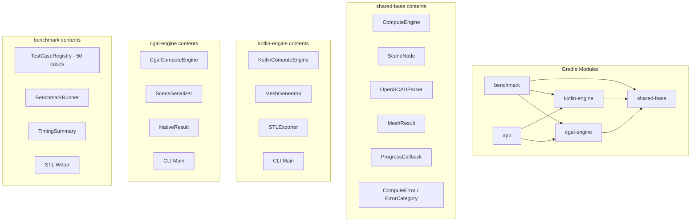

# Design Document: Engine Modularization and Benchmarks

## Overview

This design extracts the existing compute engines (`KotlinComputeEngine`, `CgalComputeEngine`) and shared types (`ComputeEngine`, `SceneNode`, `OpenSCADParser`, etc.) from the monolithic Android `app` module into three standalone Gradle modules:

1. **shared-base** — Pure-JVM library containing the `ComputeEngine` interface, data types (`MeshResult`, `ProgressCallback`, `ComputeError`, `SceneNode`), and the `OpenSCADParser`.
2. **kotlin-engine** — Depends on `shared-base`; contains `KotlinComputeEngine`, `MeshGenerator`, `STLExporter`, and a CLI `main` entry point.
3. **cgal-engine** — Depends on `shared-base`; contains `CgalComputeEngine`, `SceneSerializer`, native library loading, and a CLI `main` entry point.

A fourth module, **benchmark**, hosts 50 OpenSCAD test cases, a benchmark runner, and timing/STL infrastructure. The `app` module retains its Android-specific code and depends on both engine modules.

The key design decision is to keep modules as pure JVM libraries (no Android SDK dependency) so they compile on any JVM 17 machine and serve as a foundation for future headless "server mode" execution.

## Architecture



### Module Dependency Flow

- `shared-base` has zero Android dependencies. It uses `org.jetbrains.kotlinx:kotlinx-coroutines-core` (JVM variant, not `-android`).
- `kotlin-engine` depends only on `shared-base`.
- `cgal-engine` depends on `shared-base` and loads its native `.so`/`.dll` via `System.loadLibrary`.
- `benchmark` depends on all three: `shared-base`, `kotlin-engine`, `cgal-engine`. It uses JUnit5 + jqwik for test execution.
- `app` depends on `kotlin-engine` and `cgal-engine` (transitively pulling in `shared-base`). It retains the Android-specific renderer, UI, and ViewModel layers.

## Components and Interfaces

### shared-base Module

Package: `com.openscadviewer.engine` and `com.openscadviewer.parser`

| Class / Interface | Responsibility |
|---|---|
| `ComputeEngine` | Interface for mesh computation from a `SceneNode` |
| `MeshResult` | Data class holding vertices/normals/colors float arrays |
| `ProgressCallback` | Functional interface for progress reporting |
| `ComputeError` | Error descriptor with `ErrorCategory` |
| `ComputeException` | Exception wrapping `ComputeError` |
| `ErrorCategory` | Enum: INVALID_INPUT, COMPUTATION_FAILURE, OUT_OF_MEMORY, TIMEOUT, CANCELLED |
| `SceneNode` | Sealed class representing the OpenSCAD scene graph |
| `OpenSCADParser` | Parser: OpenSCAD source → `SceneNode` tree |

Build: `plugins { kotlin("jvm") }`, JVM target 17, no Android plugin.

### kotlin-engine Module

Package: `com.openscadviewer.engine`

| Class | Responsibility |
|---|---|
| `KotlinComputeEngine` | Pure-Kotlin mesh generation via `MeshGenerator` |
| `MeshGenerator` | Converts `SceneNode` tree into triangle mesh |
| `STLExporter` | Writes `MeshResult` to binary STL format |
| `KotlinEngineMain` | CLI entry point: parse args → parse file → compute → write STL |

CLI contract:
```
Usage: kotlin-engine <input.scad> <output.stl> [--timeout <seconds>]
Exit codes: 0 = success, 1 = argument/file error, 2 = timeout
```

### cgal-engine Module

Package: `com.openscadviewer.engine`

| Class | Responsibility |
|---|---|
| `CgalComputeEngine` | CGAL-based mesh generation via JNI |
| `SceneSerializer` | Serializes `SceneNode` to JSON for native layer |
| `NativeResult` | JNI result data holder |
| `CgalEngineMain` | CLI entry point: same contract as kotlin-engine |

### benchmark Module

Package: `com.openscadviewer.benchmark`

| Class | Responsibility |
|---|---|
| `TestCase` | Data class: name, category, openscadCode |
| `TestCaseRegistry` | Object holding all 50 test case definitions |
| `BenchmarkResult` | Data class: testCase, engine, timeMs, status, errorDetail |
| `BenchmarkRunner` | Orchestrates execution, timing, and STL writing |
| `TimingSummaryFormatter` | Formats and prints the summary table |
| `StlOutputWriter` | Writes STL files with sanitized naming |
| `BenchmarkTest` | JUnit5 test class invoking the runner |

### Key Interfaces

```kotlin
// TestCase data structure
data class TestCase(
    val name: String,        // e.g. "prim_cube_centered"
    val category: String,    // e.g. "geometry_primitives"
    val code: String         // OpenSCAD source snippet
)

// Result of a single benchmark execution
data class BenchmarkResult(
    val testCase: TestCase,
    val engineName: String,
    val timeMs: Long,
    val status: ResultStatus,
    val errorDetail: String? = null
)

enum class ResultStatus {
    SUCCESS, PARSE_ERROR, COMPUTE_ERROR, TIMEOUT, SKIPPED
}
```

### CLI Entry Point Design

Both engine CLIs share the same argument parsing logic, extracted into a shared utility in `shared-base`:

```kotlin
// In shared-base
object CliArgParser {
    data class CliArgs(
        val inputPath: String,
        val outputPath: String,
        val timeoutSeconds: Int = 60
    )

    fun parse(args: Array<String>): Result<CliArgs>
}
```

Each engine's `main` function:
1. Calls `CliArgParser.parse(args)` — exits 1 on failure
2. Reads the input file — exits 1 if not readable
3. Parses with `OpenSCADParser` — exits 1 on empty parse result
4. Computes mesh with `withTimeout(timeoutSeconds * 1000L)` — exits 2 on timeout
5. Writes binary STL via `STLExporter` — exits 0 on success

### Benchmark Runner Design

```kotlin
class BenchmarkRunner(
    private val engines: List<Pair<String, ComputeEngine>>,
    private val testCases: List<TestCase>,
    private val stlOutputDir: File,
    private val timeoutMs: Long = 120_000L
) {
    fun run(): List<BenchmarkResult>
}
```

Execution flow per test case:
1. Parse the OpenSCAD snippet with `OpenSCADParser`
2. Check if the resulting `SceneNode` tree contains at least one geometry-producing node
   - If not → record `PARSE_ERROR` with truncated snippet, time = 0, skip engine calls
3. For each available engine (sequentially):
   a. Start wall-clock timer
   b. Call `engine.compute(sceneNode)` with coroutine timeout
   c. On success → record `SUCCESS`, write STL
   d. On timeout → record `TIMEOUT` with time = 120000
   e. On error → record `COMPUTE_ERROR`
4. If engine is unavailable → record `SKIPPED` for all test cases

### Geometry Node Detection

A helper function determines if a `SceneNode` tree contains geometry-producing nodes:

```kotlin
fun SceneNode.containsGeometry(): Boolean = when (this) {
    is SceneNode.Cube, is SceneNode.Sphere, is SceneNode.Cylinder,
    is SceneNode.Circle, is SceneNode.Square, is SceneNode.Polygon -> true
    is SceneNode.Translate -> child.containsGeometry()
    is SceneNode.Rotate -> child.containsGeometry()
    is SceneNode.Scale -> child.containsGeometry()
    is SceneNode.Color -> child.containsGeometry()
    is SceneNode.LinearExtrude -> child.containsGeometry()
    is SceneNode.Union -> children.any { it.containsGeometry() }
    is SceneNode.Difference -> children.any { it.containsGeometry() }
    is SceneNode.Intersection -> children.any { it.containsGeometry() }
    is SceneNode.Group -> children.any { it.containsGeometry() }
}
```

## Data Models

### TestCase

```kotlin
data class TestCase(
    val name: String,       // max 64 chars, pattern: {category_prefix}_{label}
    val category: String,   // one of 7 defined categories
    val code: String        // OpenSCAD source, max 2048 chars
) {
    init {
        require(name.length <= 64) { "Name exceeds 64 characters" }
        require(name.matches(Regex("[a-z0-9_]+"))) { "Name must be lowercase alphanumeric + underscores" }
        require(code.length <= 2048) { "Code exceeds 2048 characters" }
        require(category in VALID_CATEGORIES) { "Invalid category: $category" }
    }

    companion object {
        val VALID_CATEGORIES = setOf(
            "geometry_primitives",
            "transformations",
            "linear_extrusion",
            "csg_operations",
            "combined_operations",
            "variables_expressions",
            "edge_cases"
        )
    }
}
```

### BenchmarkResult

```kotlin
data class BenchmarkResult(
    val testCase: TestCase,
    val engineName: String,
    val timeMs: Long,
    val status: ResultStatus,
    val errorDetail: String? = null
)

enum class ResultStatus {
    SUCCESS,
    PARSE_ERROR,
    COMPUTE_ERROR,
    TIMEOUT,
    SKIPPED
}
```

### TimingSummary

```kotlin
data class TimingSummary(
    val results: List<BenchmarkResult>
) {
    data class EngineAggregate(
        val engineName: String,
        val totalTimeMs: Long,
        val successCount: Int,
        val timeoutCount: Int,
        val errorCount: Int,
        val skippedCount: Int
    )

    fun aggregateByEngine(): List<EngineAggregate>
    fun formatTable(): String
}
```

### STL File Naming

```kotlin
object StlFileNamer {
    fun generateFilename(category: String, testName: String, engineName: String): String {
        val raw = "${category}_${testName}_${engineName}.stl"
        return raw.lowercase()
            .replace(Regex("[^a-z0-9_.]"), "_")
            .replace(Regex("_+"), "_")
    }
}
```

### Gradle Module Structure

```
Pncad/
├── settings.gradle.kts          # includes :shared-base, :kotlin-engine, :cgal-engine, :benchmark, :app
├── shared-base/
│   ├── build.gradle.kts         # kotlin("jvm"), JVM 17
│   └── src/main/kotlin/com/openscadviewer/
│       ├── engine/ (ComputeEngine, MeshResult, ProgressCallback, ComputeError, ComputeException)
│       └── parser/ (SceneNode, OpenSCADParser)
├── kotlin-engine/
│   ├── build.gradle.kts         # kotlin("jvm"), depends on :shared-base
│   └── src/main/kotlin/com/openscadviewer/engine/ (KotlinComputeEngine, MeshGenerator, STLExporter, KotlinEngineMain)
├── cgal-engine/
│   ├── build.gradle.kts         # kotlin("jvm"), depends on :shared-base
│   └── src/main/kotlin/com/openscadviewer/engine/ (CgalComputeEngine, SceneSerializer, NativeResult, CgalEngineMain)
├── benchmark/
│   ├── build.gradle.kts         # kotlin("jvm"), depends on :shared-base, :kotlin-engine, :cgal-engine
│   └── src/test/kotlin/com/openscadviewer/benchmark/ (TestCase, TestCaseRegistry, BenchmarkRunner, ...)
└── app/
    ├── build.gradle.kts         # Android, depends on :kotlin-engine, :cgal-engine
    └── src/main/java/...        # Android-specific UI, ViewModel, renderer
```

### Build System Configuration

**benchmark/build.gradle.kts** (key sections):
```kotlin
plugins {
    kotlin("jvm")
}

java {
    sourceCompatibility = JavaVersion.VERSION_17
    targetCompatibility = JavaVersion.VERSION_17
}

tasks.withType<Test> {
    useJUnitPlatform()
    testLogging {
        showStandardStreams = true
    }
}

dependencies {
    implementation(project(":shared-base"))
    implementation(project(":kotlin-engine"))
    implementation(project(":cgal-engine"))
    testImplementation("org.junit.jupiter:junit-jupiter:5.10.2")
    testImplementation("org.junit.platform:junit-platform-launcher:1.10.2")
    testImplementation("net.jqwik:jqwik:1.8.4")
    testImplementation("org.jetbrains.kotlinx:kotlinx-coroutines-test:1.7.3")
}
```

**Root build.gradle.kts** excludes benchmark from `check`:
```kotlin
// benchmark excluded from default check lifecycle
project(":benchmark") {
    tasks.named("check") {
        enabled = false
    }
}
```

## Correctness Properties

*A property is a characteristic or behavior that should hold true across all valid executions of a system — essentially, a formal statement about what the system should do. Properties serve as the bridge between human-readable specifications and machine-verifiable correctness guarantees.*

### Property 1: CLI argument validation

*For any* sequence of command-line arguments with fewer than 2 positional arguments, the CLI entry point should print a usage message to stderr and return exit code 1. *For any* non-existent or unreadable file path provided as the input argument, the CLI should print an error to stderr and return exit code 1.

**Validates: Requirements 2.1, 2.2, 2.3, 2.4**

### Property 2: Timeout flag parsing

*For any* integer value between 1 and 3600 (inclusive) passed as the `--timeout` flag, the CLI should accept it and use it as the computation timeout. *For any* value outside this range or non-integer string, the CLI should reject it with exit code 1.

**Validates: Requirements 2.6**

### Property 3: Test case structure validity

*For any* test case in the benchmark suite, the name must match the pattern `[a-z0-9_]+` with length ≤ 64, the category must be one of the 7 defined categories, the code must be ≤ 2048 characters, and parsing the code with `OpenSCADParser` must produce a `SceneNode` tree containing at least one geometry-producing node.

**Validates: Requirements 3.3, 3.6**

### Property 4: Timing measurement invariant

*For any* test case execution that completes (whether success, error, or timeout), the recorded wall-clock time must be a non-negative integer in milliseconds, and for timeout results it must equal 120000.

**Validates: Requirements 4.1, 4.2**

### Property 5: Unavailable engine produces all-skipped results

*For any* compute engine that reports `isAvailable() == false` and any set of test cases, the benchmark runner must record every result for that engine with status `SKIPPED`.

**Validates: Requirements 4.4**

### Property 6: Error recording and continuation

*For any* sequence of test cases where one or more produce computation errors, the benchmark runner must record those as `COMPUTE_ERROR` and still produce results for all remaining test cases (total result count equals test cases × available engines).

**Validates: Requirements 4.5**

### Property 7: Timing summary correctness

*For any* list of `BenchmarkResult` values, the formatted timing summary must contain one row per result with all required columns (test name, category, engine, time, status), and the per-engine aggregate totals (total time, success count, timeout count, error count, skipped count) must equal the sum of individual results for that engine.

**Validates: Requirements 4.6, 4.7**

### Property 8: STL filename sanitization

*For any* category string, test case name, and engine name, the generated STL filename must be lowercase, contain only `[a-z0-9_.]` characters, have no consecutive underscores, and end with `.stl`.

**Validates: Requirements 5.2**

### Property 9: No STL output for non-success results

*For any* benchmark result with status `TIMEOUT`, `COMPUTE_ERROR`, `PARSE_ERROR`, or `SKIPPED`, no STL file must be written for that test case and engine combination.

**Validates: Requirements 5.4**

### Property 10: Parse error detection and handling

*For any* non-empty OpenSCAD snippet that parses to a `SceneNode` tree containing no geometry-producing nodes, the benchmark runner must record status `PARSE_ERROR`, set execution time to 0 milliseconds, and must not invoke the compute engine.

**Validates: Requirements 7.1, 7.5**

### Property 11: Error snippet truncation

*For any* OpenSCAD snippet that triggers a parse error, the error detail in the benchmark result must contain the snippet content truncated to at most 256 characters.

**Validates: Requirements 7.2**

### Property 12: Result status enum constraint

*For any* benchmark result row, the status value must be exactly one of: `SUCCESS`, `PARSE_ERROR`, `COMPUTE_ERROR`, `TIMEOUT`, or `SKIPPED`.

**Validates: Requirements 7.3**

## Error Handling

### Parser Errors
- If `OpenSCADParser.parse()` throws an exception → catch and treat as `PARSE_ERROR`
- If parse result contains no geometry nodes → `PARSE_ERROR` (not a crash, just an empty scene)
- Error detail includes the truncated source snippet for triage

### Compute Errors
- `ComputeException` with any `ErrorCategory` → `COMPUTE_ERROR`
- Unexpected exceptions (e.g., `OutOfMemoryError`) → `COMPUTE_ERROR` with exception message
- Timeout via `withTimeoutOrNull` → `TIMEOUT`

### CLI Errors
- Missing arguments → usage message on stderr, exit 1
- File not found / not readable → error message on stderr, exit 1
- Parse failure (no geometry) → error message on stderr, exit 1
- Computation timeout → error message on stderr, exit 2
- Computation error → error message on stderr, exit 1

### I/O Errors
- STL file write failure → log warning, continue (do not abort suite)
- Output directory creation failure → log warning, skip STL writing for remaining files

### Engine Availability
- `isAvailable() == false` → skip engine entirely, record all results as `SKIPPED`
- Native library load failure (CGAL) → `isAvailable()` returns false, handled gracefully

## Testing Strategy

### Property-Based Testing (jqwik)

This feature is well-suited for property-based testing because several components have pure functional logic with universal properties (filename sanitization, summary computation, parse error detection, result classification). The project already uses jqwik 1.8.4.

**Configuration:**
- Minimum 100 iterations per property test
- Each test tagged with: `Feature: engine-modularization-and-benchmarks, Property {N}: {title}`
- Library: `net.jqwik:jqwik:1.8.4`

**Property tests to implement:**
1. CLI argument validation (Property 1)
2. Timeout flag parsing (Property 2)
3. Test case structure validity (Property 3)
4. Timing measurement invariant (Property 4)
5. Unavailable engine → skipped (Property 5)
6. Error recording and continuation (Property 6)
7. Timing summary correctness (Property 7)
8. STL filename sanitization (Property 8)
9. No STL for non-success (Property 9)
10. Parse error detection and handling (Property 10)
11. Error snippet truncation (Property 11)
12. Result status enum constraint (Property 12)

### Unit Tests (JUnit5)

- CLI with 0 and 1 arguments → exit code 1
- CLI with `--timeout 0` and `--timeout 3601` → exit code 1
- CLI with valid file → successful STL output
- Timeout behavior with mock slow engine
- STL output directory creation when missing
- I/O error handling with write failure mock
- Category minimum count verification
- Nesting depth requirements per category

### Integration Tests

- Full `./gradlew :benchmark:test` execution
- `./gradlew :kotlin-engine:build` without Android SDK
- Existing app tests pass after module extraction
- End-to-end CLI: input .scad → output .stl

### Test Organization

```
benchmark/src/test/kotlin/com/openscadviewer/benchmark/
├── BenchmarkRunnerTest.kt        # Unit + property tests for runner logic
├── TimingSummaryPropertyTest.kt  # Property tests for summary formatting
├── StlFileNamerPropertyTest.kt   # Property tests for filename sanitization
├── TestCaseRegistryTest.kt       # Structure validation of all 50 cases
├── ParseErrorDetectionTest.kt    # Property tests for parse error logic
└── BenchmarkIntegrationTest.kt   # Full suite execution test

shared-base/src/test/kotlin/com/openscadviewer/engine/
└── CliArgParserPropertyTest.kt   # Property tests for CLI arg parsing
```
