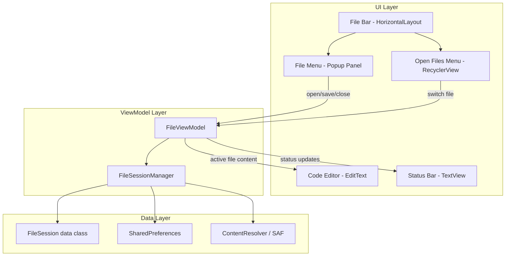
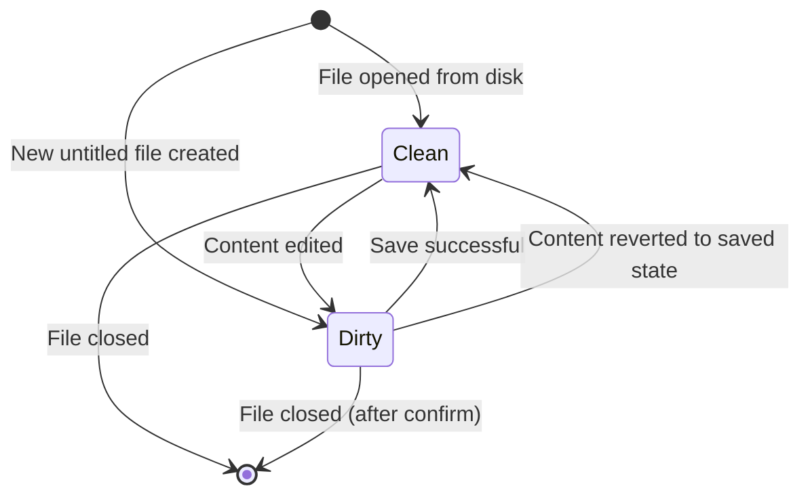

# Design Document: File Management

## Overview

This design adds multi-file session management to the OpenSCAD Viewer app, replacing the current single-file workflow. The core changes are:

1. A new **File Bar** UI layer between the toolbar and TabLayout with expandable icon menus for file operations and open-file switching.
2. A **FileSession** data model representing each open file's state (URI, content, cursor, dirty flag).
3. A **FileSessionManager** in the ViewModel layer that maintains the ordered list of open sessions, handles open/save/close logic, and persists the last-active URI.
4. Integration with Android's `ContentResolver` and SAF (Storage Access Framework) for reading, writing, and persisting URI permissions.

The existing `MainViewModel` gets extended (or composed with a dedicated `FileViewModel`) to hold the list of `FileSession` objects and the active-file pointer. The `MainActivity` is refactored to delegate file I/O through the session manager rather than directly reading URIs into the editor.

## Architecture



### Key Design Decisions

1. **Separate FileViewModel** rather than extending `MainViewModel`: The existing ViewModel handles renderer/camera/compute state. File session management is orthogonal and benefits from a dedicated ViewModel scoped to the Activity. Both ViewModels coexist via `ViewModelProvider`.

2. **FileSessionManager as a plain class** (not ViewModel): Owned by `FileViewModel`, encapsulates session list logic. This keeps the ViewModel thin (state holder + coroutine scope) and makes the session logic independently unit-testable without Android dependencies.

3. **MRU ordering via LinkedHashMap-style list**: Sessions are stored in a `MutableList<FileSession>` where switching/opening moves the target to position 0. This gives O(n) reorder for small n (max 20) which is acceptable.

4. **File Bar as a custom LinearLayout** inflated into the existing ConstraintLayout between toolbar and TabLayout. Popup panels use `PopupWindow` positioned below the triggering icon, matching Material Design dropdown patterns.

5. **Dirty state via content comparison**: The `FileSession` stores `lastSavedContent: String`. After each text change (debounced), we compare `editorContent != lastSavedContent`. This avoids maintaining an undo-stack-based dirty flag.

## Components and Interfaces

### FileSession (Data Class)

```kotlin
data class FileSession(
    val id: String = UUID.randomUUID().toString(),
    var uri: Uri?,
    var displayName: String,
    var content: String,
    var lastSavedContent: String,
    var cursorPosition: Int = 0,
    var lastAccessedTimestamp: Long = System.currentTimeMillis()
) {
    val isDirty: Boolean
        get() = content != lastSavedContent
}
```

### FileSessionManager

Responsibilities:
- Maintain ordered list of `FileSession` objects (MRU first)
- Enforce max 20 sessions
- Provide open/save/saveAs/close operations
- Persist last-active URI to SharedPreferences

```kotlin
class FileSessionManager(
    private val prefs: SharedPreferences
) {
    private val sessions: MutableList<FileSession> = mutableListOf()
    val maxSessions = 20

    fun getOrderedSessions(): List<FileSession>
    fun getActiveSession(): FileSession?
    fun openFile(uri: Uri, displayName: String, content: String): Result<FileSession>
    fun switchTo(sessionId: String): FileSession?
    fun updateContent(sessionId: String, content: String, cursorPosition: Int)
    fun markSaved(sessionId: String, newUri: Uri? = null, newDisplayName: String? = null)
    fun closeSession(sessionId: String): FileSession? // returns new active, or null
    fun findByUri(uri: Uri): FileSession?
    fun createUntitled(): FileSession
    fun persistActiveUri()
    fun getPersistedUri(): Uri?
    fun clearPersistedUri()
}
```

### FileViewModel (AndroidX ViewModel)

```kotlin
class FileViewModel(application: Application) : AndroidViewModel(application) {
    private val sessionManager: FileSessionManager
    
    // Exposed state as LiveData
    val activeSession: LiveData<FileSession?>
    val sessions: LiveData<List<FileSession>>
    val statusMessage: LiveData<String>
    val errorEvent: LiveData<Event<String>>
    
    // Operations (launch coroutines for I/O)
    fun openFilePicker() // triggers SAF intent via event
    fun handleFileSelected(uri: Uri)
    fun save()
    fun saveAs() // triggers SAF create intent via event
    fun handleSaveAsDestination(uri: Uri)
    fun closeActiveFile()
    fun closeWithConfirmation(): CloseAction // returns whether confirmation needed
    fun confirmClose(action: CloseDialogChoice)
    fun switchToFile(sessionId: String)
    fun onEditorContentChanged(content: String, cursorPosition: Int)
    fun restoreOnLaunch(intentUri: Uri?)
}
```

### FileBar (Custom View / Layout)

A horizontal `LinearLayout` containing two `ImageButton` views:
- File icon (folder icon) — toggles `FileMenu`
- Open Files icon (multi-file icon) — toggles `OpenFilesMenu`

### FileMenu (PopupWindow)

Contains four icon buttons in a vertical or grid layout:
- Open (folder-open icon)
- Save (floppy/save icon)
- Save As (save-as icon)
- Close (close icon)

### OpenFilesMenu (PopupWindow with RecyclerView)

- Vertically scrollable list of open file names
- Active file highlighted with accent background
- Dirty indicator (asterisk prefix) on modified files
- Tap to switch

### FileContentReader (Utility)

```kotlin
object FileContentReader {
    fun readContent(contentResolver: ContentResolver, uri: Uri): Result<String>
    fun writeContent(contentResolver: ContentResolver, uri: Uri, content: String): Result<Unit>
    fun getDisplayName(contentResolver: ContentResolver, uri: Uri): String
}
```

## Data Models

### FileSession State Diagram



### Persistence Model

| Storage | Key | Value | Purpose |
|---------|-----|-------|---------|
| SharedPreferences | `last_active_file_uri` | URI string | Resume on launch |

### Session List Invariants

- `sessions.size` ∈ [0, 20]
- At most one session has `id == activeSessionId` at any time
- If `sessions` is non-empty, exactly one session is active
- Each session's `uri` is unique within the list (no duplicate URIs), or `null` for untitled files
- Sessions are ordered by `lastAccessedTimestamp` descending (MRU first)

### Close Confirmation Dialog Model

```kotlin
enum class CloseDialogChoice { SAVE, DISCARD, CANCEL }
```

### Event Wrapper for Single-Shot UI Events

```kotlin
class Event<out T>(private val content: T) {
    var hasBeenHandled = false; private set
    fun getContentIfNotHandled(): T? =
        if (hasBeenHandled) null else { hasBeenHandled = true; content }
}
```

## Correctness Properties

*A property is a characteristic or behavior that should hold true across all valid executions of a system — essentially, a formal statement about what the system should do. Properties serve as the bridge between human-readable specifications and machine-verifiable correctness guarantees.*

### Property 1: Open file creates active session

*For any* valid file content string and display name, when a file is opened via `openFile()`, the resulting session list SHALL contain a session with matching content and display name, and that session SHALL be the active session.

**Validates: Requirements 2.2, 2.4**

### Property 2: Opening duplicate URI reuses existing session

*For any* session list containing a session with URI X, when `openFile()` is called with the same URI X, the session list size SHALL remain unchanged and the existing session for URI X SHALL become the active session.

**Validates: Requirements 2.3**

### Property 3: Failed I/O preserves session state

*For any* session list state and active session, when a file operation (open, save, save-as) fails, the session list, active session pointer, each session's content, and each session's dirty state SHALL remain identical to their pre-operation values.

**Validates: Requirements 2.6, 3.4, 4.5, 5.6**

### Property 4: Save clears dirty state

*For any* session with arbitrary content, after `markSaved()` is called, the session's `isDirty` property SHALL be `false` (because `lastSavedContent` is updated to equal `content`).

**Validates: Requirements 3.2, 4.4, 8.5**

### Property 5: Save-as updates session identity

*For any* session and any new URI and display name, after `markSaved(newUri, newDisplayName)` is called, the session's `uri` SHALL equal the new URI and `displayName` SHALL equal the new display name.

**Validates: Requirements 4.3**

### Property 6: Close removes session and promotes next MRU

*For any* session list with at least 2 sessions, when the active session is closed, the list size SHALL decrease by 1, the closed session SHALL no longer appear in the list, and the new active session SHALL be the most-recently-accessed remaining session.

**Validates: Requirements 5.1, 5.2**

### Property 7: MRU ordering invariant

*For any* sequence of `openFile()` and `switchTo()` operations, the session list SHALL always be ordered by `lastAccessedTimestamp` descending, with the active session at index 0.

**Validates: Requirements 6.1, 6.5**

### Property 8: Session state isolation on switch

*For any* two sessions A and B with distinct content and cursor positions, switching from A to B and back to A SHALL preserve A's content, cursor position, and dirty state exactly as they were before the switch.

**Validates: Requirements 6.2**

### Property 9: Session count capped at 20

*For any* sequence of `openFile()` operations, the session list size SHALL never exceed 20.

**Validates: Requirements 6.7**

### Property 10: Dirty state reflects content divergence

*For any* session, `isDirty` SHALL be `true` if and only if `content != lastSavedContent`.

**Validates: Requirements 8.1, 8.2**

### Property 11: Initial dirty state correctness

*For any* file content string, a session created via `openFile()` (from disk) SHALL have `isDirty == false`, and a session created via `createUntitled()` SHALL have `isDirty == true`.

**Validates: Requirements 8.6, 8.7**

## Error Handling

| Scenario | Detection | Response | Recovery |
|----------|-----------|----------|----------|
| File read failure (open) | `ContentResolver.openInputStream()` throws or returns null | Show Snackbar with error message | Retain current active file unchanged |
| File write failure (save) | `ContentResolver.openOutputStream()` throws or returns null | Show Snackbar for 4+ seconds with reason | Retain dirty state and content unchanged |
| URI permission revoked | `SecurityException` on read/write | Show Snackbar; if on launch, clear persisted URI | Fall back to empty editor on launch; on save, trigger Save As |
| Max sessions reached | `sessions.size >= 20` check before add | Show Snackbar "Maximum 20 files open" | Reject the open operation; no state change |
| Corrupted SharedPreferences | Malformed URI string | Catch `IllegalArgumentException` from `Uri.parse()` | Clear persisted URI, show empty editor |
| File deleted externally | `FileNotFoundException` on save | Show Snackbar with error | Retain content, offer Save As |

### Error Design Principles

1. **Never lose user work**: Any I/O failure preserves the in-memory content and dirty state.
2. **Inform, don't block**: Errors use non-modal Snackbar messages (4s duration for errors, 3s for success).
3. **Graceful degradation**: If the persisted URI fails on launch, the app falls back to an empty editor rather than crashing.

## Testing Strategy

### Property-Based Tests (jqwik)

The `FileSessionManager` class contains the core session logic and is a pure-logic class (no Android dependencies beyond `SharedPreferences`, which can be faked). Each correctness property maps to a jqwik `@Property` test with minimum 100 tries.

**Library**: jqwik 1.8.4 (already in project dependencies)
**Configuration**: Each test runs with `tries = 100` minimum
**Tag format**: `Feature: file-management, Property {N}: {title}`

Tests will live in `app/src/test/kotlin/com/openscadviewer/file/FileSessionManagerPropertyTest.kt`.

Custom generators needed:
- `fileContents()`: Random UTF-8 strings (1–10000 chars, including special characters, Unicode)
- `displayNames()`: Random filenames with `.scad` extension
- `uris()`: Random `content://` URI strings
- `sessionLists()`: Random lists of 1–20 FileSession objects with unique URIs
- `operationSequences()`: Random sequences of open/switch/close/save operations

### Unit Tests (JUnit 5)

For specific examples and edge cases:
- Empty editor state when no files are open
- Toggle behavior of File Bar menus (mutual exclusion)
- Save As with null URI triggers document creator
- Close last file shows placeholder
- Close dirty file shows exactly 3 dialog options
- Concurrency guard on save (ignore duplicate taps)

### Integration Tests

For Android component interaction:
- SAF intent parameters (MIME type, suggested filename)
- ContentResolver read/write with mock URIs
- SharedPreferences persistence and retrieval
- URI permission management
- Launch behavior (intent vs. persisted vs. fresh)

