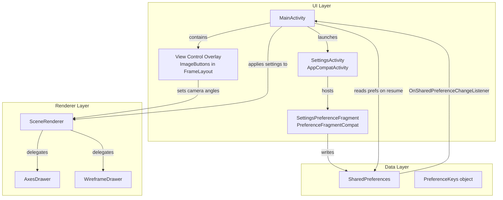

# Design Document: Preview Controls and Settings

## Overview

This design adds three capabilities to the 3D preview screen of the OpenSCAD Viewer app:

1. **View Control Overlay** — Four icon buttons (Top, Front, Left, Right) overlaid on the GLSurfaceView that snap the camera to standard orthographic positions.
2. **Display Settings** — A Settings screen (PreferenceFragment) with toggles for coordinate axes and wireframe overlay.
3. **Background Color Presets** — A list preference with three predefined clear-color options (Dark Grey, White, Yellow).

All preferences are persisted via SharedPreferences and applied to `SceneRenderer` at startup and on change. The renderer is extended with lightweight drawing passes for axes and wireframe that do not affect the main mesh data or shader program.

## Architecture



The architecture follows the existing pattern: `MainActivity` owns the `GLSurfaceView` and `SceneRenderer`. New overlay buttons are added directly in the preview `FrameLayout`. Settings are managed by a dedicated `SettingsActivity` hosting a `PreferenceFragmentCompat`. Preference changes flow back to `SceneRenderer` via `SharedPreferences.OnSharedPreferenceChangeListener` registered in `MainActivity`.

## Components and Interfaces

### 1. PreferenceKeys (Object)

A single-source-of-truth for all SharedPreferences keys and default values.

```kotlin
// com.openscadviewer.settings.PreferenceKeys
object PreferenceKeys {
    const val KEY_SHOW_AXES = "pref_show_axes"
    const val KEY_SHOW_WIREFRAME = "pref_show_wireframe"
    const val KEY_BACKGROUND_COLOR = "pref_background_color"

    const val DEFAULT_SHOW_AXES = false
    const val DEFAULT_SHOW_WIREFRAME = false
    const val DEFAULT_BACKGROUND_COLOR = "dark_grey"  // "dark_grey" | "white" | "yellow"
}
```

### 2. SettingsActivity / SettingsPreferenceFragment

A simple `AppCompatActivity` that hosts a `PreferenceFragmentCompat`. It uses an XML preference screen definition (`res/xml/preferences.xml`).

```kotlin
// com.openscadviewer.settings.SettingsActivity
class SettingsActivity : AppCompatActivity() {
    override fun onCreate(savedInstanceState: Bundle?) {
        super.onCreate(savedInstanceState)
        setContentView(R.layout.activity_settings)
        supportFragmentManager.beginTransaction()
            .replace(R.id.settings_container, SettingsPreferenceFragment())
            .commit()
        supportActionBar?.setDisplayHomeAsUpEnabled(true)
    }
}

// com.openscadviewer.settings.SettingsPreferenceFragment
class SettingsPreferenceFragment : PreferenceFragmentCompat() {
    override fun onCreatePreferences(savedInstanceState: Bundle?, rootKey: String?) {
        setPreferencesFromResource(R.xml.preferences, rootKey)
    }
}
```

### 3. View Control Overlay (Layout + Click Handlers)

Four `ImageButton` views positioned in the top-right of `previewContainer` FrameLayout. They are defined in a separate include layout (`res/layout/view_controls_overlay.xml`) and inflated inside the existing `FrameLayout`.

```kotlin
// In MainActivity — setup click listeners
private fun setupViewControls() {
    findViewById<ImageButton>(R.id.btnViewTop).setOnClickListener { snapCamera(90f, 0f) }
    findViewById<ImageButton>(R.id.btnViewFront).setOnClickListener { snapCamera(0f, 0f) }
    findViewById<ImageButton>(R.id.btnViewLeft).setOnClickListener { snapCamera(0f, 90f) }
    findViewById<ImageButton>(R.id.btnViewRight).setOnClickListener { snapCamera(0f, -90f) }
}

private fun snapCamera(rotX: Float, rotY: Float) {
    sceneRenderer?.let { renderer ->
        renderer.cameraRotX = rotX
        renderer.cameraRotY = rotY
        // preserve cameraDistance and cameraPanX/Y
        glSurfaceView?.requestRender()
    }
}
```

### 4. SceneRenderer Extensions

New mutable properties added to `SceneRenderer`:

```kotlin
// Display settings (set from UI thread, read from GL thread)
@Volatile var showAxes: Boolean = false
@Volatile var showWireframe: Boolean = false
@Volatile var backgroundColorRgba: FloatArray = floatArrayOf(0.18f, 0.18f, 0.18f, 1.0f)
```

The `onDrawFrame` method is extended:
1. Apply `backgroundColorRgba` via `glClearColor` before `glClear`.
2. After the main mesh draw, conditionally call `AxesDrawer.draw(...)`.
3. After the main mesh draw, conditionally call `WireframeDrawer.draw(...)`.

### 5. AxesDrawer

A helper class that draws three colored lines at the origin using a minimal shader program (position + uniform color). It uses `GL_LINES` with 6 vertices (two per axis).

```kotlin
// com.openscadviewer.renderer.AxesDrawer
class AxesDrawer {
    private var program = 0
    private var vertexBuffer: FloatBuffer? = null

    fun initialize() { /* compile simple pos-only shader, create line VBO */ }

    fun draw(mvpMatrix: FloatArray, axisLength: Float) {
        // Builds 6 vertices: origin→(len,0,0), origin→(0,len,0), origin→(0,0,len)
        // Draws each pair with a uniform color (red, green, blue)
    }
}
```

The axis length is computed as `max(boundingBoxDiagonal * 0.5, 1.0)` so it scales with the model.

### 6. WireframeDrawer

Reuses the existing mesh vertex data and draws it with `GL_LINES` using `glPolygonOffset` to avoid z-fighting.

```kotlin
// com.openscadviewer.renderer.WireframeDrawer
class WireframeDrawer {
    private var program = 0
    private var indexBuffer: ShortBuffer? = null

    fun initialize() { /* compile simple flat-color shader */ }

    fun setMeshData(vertices: FloatBuffer, vertexCount: Int) { /* store reference */ }

    fun draw(mvpMatrix: FloatArray) {
        // Enable polygon offset, draw triangles as GL_LINE_LOOP per face,
        // or generate edge index buffer and draw GL_LINES.
        // Use contrasting dark/light color based on current background.
    }
}
```

### 7. Preference Change Listener (in MainActivity)

```kotlin
private val prefListener = SharedPreferences.OnSharedPreferenceChangeListener { prefs, key ->
    when (key) {
        PreferenceKeys.KEY_SHOW_AXES -> {
            sceneRenderer?.showAxes = prefs.getBoolean(key, PreferenceKeys.DEFAULT_SHOW_AXES)
            glSurfaceView?.requestRender()
        }
        PreferenceKeys.KEY_SHOW_WIREFRAME -> {
            sceneRenderer?.showWireframe = prefs.getBoolean(key, PreferenceKeys.DEFAULT_SHOW_WIREFRAME)
            glSurfaceView?.requestRender()
        }
        PreferenceKeys.KEY_BACKGROUND_COLOR -> {
            sceneRenderer?.backgroundColorRgba = mapBackgroundColor(
                prefs.getString(key, PreferenceKeys.DEFAULT_BACKGROUND_COLOR) ?: PreferenceKeys.DEFAULT_BACKGROUND_COLOR
            )
            glSurfaceView?.requestRender()
        }
    }
}
```

## Data Models

### Preference Storage Schema (SharedPreferences)

| Key | Type | Default | Values |
|-----|------|---------|--------|
| `pref_show_axes` | Boolean | `false` | true / false |
| `pref_show_wireframe` | Boolean | `false` | true / false |
| `pref_background_color` | String | `"dark_grey"` | `"dark_grey"`, `"white"`, `"yellow"` |

### Background Color Mapping

```kotlin
fun mapBackgroundColor(key: String): FloatArray = when (key) {
    "dark_grey" -> floatArrayOf(0.18f, 0.18f, 0.18f, 1.0f)
    "white"     -> floatArrayOf(1.0f, 1.0f, 1.0f, 1.0f)
    "yellow"    -> floatArrayOf(1.0f, 1.0f, 0.5f, 1.0f)
    else        -> floatArrayOf(0.18f, 0.18f, 0.18f, 1.0f)
}
```

### Camera Snap Positions

| Button | cameraRotX | cameraRotY |
|--------|-----------|-----------|
| Top    | 90°       | 0°        |
| Front  | 0°        | 0°        |
| Left   | 0°        | 90°       |
| Right  | 0°        | -90°      |

### Layout Structure for View Controls Overlay

```xml
<!-- res/layout/view_controls_overlay.xml (included inside previewContainer FrameLayout) -->
<LinearLayout
    android:id="@+id/viewControlsOverlay"
    android:layout_width="wrap_content"
    android:layout_height="wrap_content"
    android:layout_gravity="top|end"
    android:layout_margin="8dp"
    android:orientation="vertical"
    android:background="@drawable/overlay_background"
    android:padding="4dp">

    <ImageButton android:id="@+id/btnViewTop" ... android:contentDescription="Top view" />
    <ImageButton android:id="@+id/btnViewFront" ... android:contentDescription="Front view" />
    <ImageButton android:id="@+id/btnViewLeft" ... android:contentDescription="Left view" />
    <ImageButton android:id="@+id/btnViewRight" ... android:contentDescription="Right view" />
</LinearLayout>
```

### Preference Screen XML

```xml
<!-- res/xml/preferences.xml -->
<PreferenceScreen xmlns:android="http://schemas.android.com/apk/res/android">

    <PreferenceCategory android:title="Display">
        <SwitchPreferenceCompat
            android:key="pref_show_axes"
            android:title="Show Coordinate Axes"
            android:summary="Display X/Y/Z orientation lines at the origin"
            android:defaultValue="false" />

        <SwitchPreferenceCompat
            android:key="pref_show_wireframe"
            android:title="Show Wireframe"
            android:summary="Overlay mesh edges on the shaded model"
            android:defaultValue="false" />

        <ListPreference
            android:key="pref_background_color"
            android:title="Background Color"
            android:summary="Choose preview background"
            android:entries="@array/bg_color_labels"
            android:entryValues="@array/bg_color_values"
            android:defaultValue="dark_grey" />
    </PreferenceCategory>

</PreferenceScreen>
```


## Correctness Properties

*A property is a characteristic or behavior that should hold true across all valid executions of a system — essentially, a formal statement about what the system should do. Properties serve as the bridge between human-readable specifications and machine-verifiable correctness guarantees.*

### Property 1: Camera snap preserves distance and pan offsets

*For any* initial values of `cameraDistance`, `cameraPanX`, and `cameraPanY`, and *for any* view control button tap (Top, Front, Left, Right), after the snap operation completes, `cameraDistance`, `cameraPanX`, and `cameraPanY` shall remain equal to their pre-snap values.

**Validates: Requirements 2.6**

### Property 2: Axis length scales proportionally with bounding box

*For any* valid mesh bounding box (where max > min in at least one dimension), the computed axis length shall be a consistent proportional function of the bounding box diagonal, such that `axisLength == f(diagonal)` where `f` is a monotonically increasing function.

**Validates: Requirements 3.4**

### Property 3: Preferences round-trip persistence

*For any* valid combination of preference values (showAxes ∈ {true, false}, showWireframe ∈ {true, false}, backgroundColor ∈ {"dark_grey", "white", "yellow"}), writing all three to SharedPreferences and then reading them back shall return the exact same values.

**Validates: Requirements 6.1, 5.6**

### Property 4: Invalid preference values fall back to defaults

*For any* string that is not in the valid set {"dark_grey", "white", "yellow"}, the `mapBackgroundColor` function shall return the default Dark Grey color (0.18, 0.18, 0.18, 1.0). Similarly, for any missing or non-boolean value in axes/wireframe preferences, the system shall use `false`.

**Validates: Requirements 6.3**

## Error Handling

| Scenario | Handling |
|----------|----------|
| SharedPreferences returns null for background color key | `mapBackgroundColor` uses `"dark_grey"` via the `else` branch |
| SharedPreferences file is corrupted or missing keys | All reads use explicit default parameters: `getBoolean(key, false)`, `getString(key, "dark_grey")` |
| OpenGL shader compilation failure (axes/wireframe) | Log error, set a flag to skip the drawing pass — main mesh rendering is unaffected |
| AxesDrawer or WireframeDrawer `initialize()` called before GL context ready | Guard with `program != 0` check before draw; initialize lazily in first `onDrawFrame` call |
| View control button tapped when no mesh is loaded | `snapCamera` still sets angles (no-op visually since nothing renders), no crash |
| `cameraDistance` is 0 or negative after edge-case manipulation | `coerceIn(0.1f, 1000f)` guard already exists in `TouchHandler`; snap does not modify distance |

## Testing Strategy

### Unit Tests (Example-based)

| Test | What it verifies |
|------|-----------------|
| `snapCamera(Top)` sets rotX=90, rotY=0 | Requirement 2.1 |
| `snapCamera(Front)` sets rotX=0, rotY=0 | Requirement 2.2 |
| `snapCamera(Left)` sets rotX=0, rotY=90 | Requirement 2.3 |
| `snapCamera(Right)` sets rotX=0, rotY=-90 | Requirement 2.4 |
| `mapBackgroundColor("dark_grey")` returns correct RGBA | Requirement 5.2 |
| `mapBackgroundColor("white")` returns correct RGBA | Requirement 5.3 |
| `mapBackgroundColor("yellow")` returns correct RGBA | Requirement 5.4 |
| Preference listener updates renderer fields on change | Requirements 3.5, 4.4, 5.5 |
| Default preferences loaded when prefs are empty | Requirement 6.3 |
| Overlay visibility matches preview tab + mesh loaded state | Requirement 1.1 |

### Property-Based Tests (jqwik)

The project already uses `net.jqwik:jqwik:1.8.4`. Each property test runs a minimum of 100 iterations.

| Property | Generator strategy |
|----------|-------------------|
| Property 1: Camera snap preserves distance/pan | Generate random `Float` for distance (0.1–1000), panX (-500–500), panY (-500–500). Pick random snap direction. |
| Property 2: Axis length proportional to bounding box | Generate random bounding box with min < max in each axis. Compute axis length. Verify proportionality. |
| Property 3: Preferences round-trip | Generate random valid combos of the three prefs. Write to `SharedPreferences` (use Robolectric or in-memory map). Read back. Assert equality. |
| Property 4: Invalid prefs fallback | Generate arbitrary strings (excluding valid keys). Pass to `mapBackgroundColor`. Assert default returned. |

Each test is tagged with: `// Feature: preview-controls-and-settings, Property N: <property text>`

### Integration Tests

- Launch `SettingsActivity`, toggle axes, return to preview, verify `showAxes` is true on renderer.
- Change background color in settings, verify `glClearColor` arguments on next frame.
- Tap view control button, verify `requestRender()` called and camera angles updated.

### What is NOT property-tested

- OpenGL rendering output (visual correctness) — use manual QA and screenshot comparison.
- Layout positioning of overlay buttons — use Espresso view assertions.
- Touch event propagation — use instrumented UI tests.
