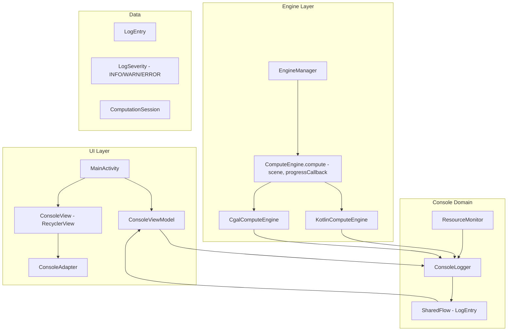
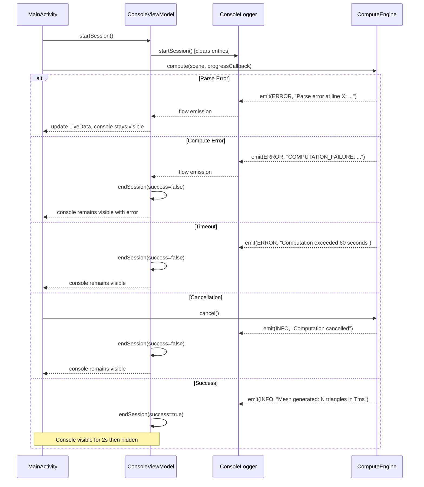

# Design Document: Render Console View

## Overview

This design adds a live console view to the OpenSCAD Viewer app that displays real-time progress messages, log output, and resource usage while the compute engine generates a preview or STL export. The console overlays the 3D preview area and provides timestamped, severity-colored log entries so users can monitor parsing, computation steps, warnings, and errors during potentially long-running operations.

Key design decisions:
- **Kotlin Flow for log streaming**: `ConsoleLogger` emits `LogEntry` items via a `SharedFlow`, allowing multiple collectors (UI, persistence) to observe messages concurrently without coupling.
- **Overlay approach**: The console is a `RecyclerView` placed inside the existing `previewContainer` `FrameLayout`, overlaying the GLSurfaceView rather than replacing it. This allows a smooth transition when computation completes.
- **Progress callback on ComputeEngine**: The `ComputeEngine` interface gains an optional `ProgressCallback` parameter so both Kotlin and CGAL engines can emit progress without breaking existing consumers.
- **Resource monitoring via coroutine ticker**: A dedicated coroutine polls `Runtime.getRuntime()` memory and `/proc/self/stat` CPU time at 1-second intervals during active sessions, emitting resource entries to the same log flow.

## Architecture



### Data Flow

1. User taps "Preview" or "Render STL" → `MainActivity` starts a new `ComputationSession`
2. `ConsoleLogger.startSession()` clears previous entries, makes console visible
3. `ComputeEngine.compute(scene, progressCallback)` is called with a lambda that forwards messages to `ConsoleLogger`
4. Engine emits progress messages (parsing started, node count, mesh generation, etc.) → `ConsoleLogger` adds timestamp and emits via `SharedFlow`
5. `ConsoleViewModel` collects the flow, updates `LiveData<List<LogEntry>>` observed by `ConsoleAdapter`
6. `ResourceMonitor` polls memory/CPU every 1 second, emits resource log entries
7. On completion/failure/cancellation, a final log entry is emitted and the console transitions per requirements (2s delay on success, stays visible on error)

## Components and Interfaces

### LogEntry and LogSeverity

```kotlin
package com.openscadviewer.console

enum class LogSeverity {
    INFO, WARN, ERROR
}

data class LogEntry(
    val timestamp: Long,        // System.currentTimeMillis()
    val severity: LogSeverity,
    val message: String
) {
    fun formattedTimestamp(): String {
        val sdf = java.text.SimpleDateFormat("HH:mm:ss.SSS", java.util.Locale.US)
        return sdf.format(java.util.Date(timestamp))
    }
}
```

### ProgressCallback

A functional interface added to `ComputeEngine` to allow engines to emit progress:

```kotlin
package com.openscadviewer.engine

/**
 * Callback for engines to report computation progress.
 * Invoked on background threads; implementations must handle thread-safety.
 */
fun interface ProgressCallback {
    fun onProgress(message: String, severity: String = "INFO")
}
```

### Updated ComputeEngine Interface

```kotlin
interface ComputeEngine {
    /**
     * Compute triangle mesh from scene graph.
     * @param scene Root node of the parsed scene graph
     * @param progress Optional callback for progress reporting
     * @return Result containing either mesh data or error
     */
    suspend fun compute(
        scene: SceneNode,
        progress: ProgressCallback? = null
    ): Result<MeshResult>

    fun cancel()
    fun isAvailable(): Boolean
}
```

The `progress` parameter defaults to `null` to maintain backward compatibility with existing call sites.

### ConsoleLogger

```kotlin
package com.openscadviewer.console

import kotlinx.coroutines.flow.MutableSharedFlow
import kotlinx.coroutines.flow.SharedFlow
import kotlinx.coroutines.flow.asSharedFlow

/**
 * Collects log messages from computation pipeline and emits them for display.
 * Thread-safe: can be called from any coroutine context.
 */
class ConsoleLogger {
    private val _entries = MutableSharedFlow<LogEntry>(
        replay = 100,
        extraBufferCapacity = 50
    )
    val entries: SharedFlow<LogEntry> = _entries.asSharedFlow()

    private val _allEntries = mutableListOf<LogEntry>()
    val allEntries: List<LogEntry> get() = _allEntries.toList()

    private var sessionActive = false

    fun startSession() {
        _allEntries.clear()
        _entries.resetReplayCache()
        sessionActive = true
        emit(LogSeverity.INFO, "Session started")
    }

    fun endSession(success: Boolean) {
        sessionActive = false
        if (success) {
            emit(LogSeverity.INFO, "Computation completed successfully")
        }
    }

    fun emit(severity: LogSeverity, message: String) {
        val entry = LogEntry(
            timestamp = System.currentTimeMillis(),
            severity = severity,
            message = message
        )
        _allEntries.add(entry)
        _entries.tryEmit(entry)
    }

    fun isSessionActive(): Boolean = sessionActive

    fun clear() {
        _allEntries.clear()
        _entries.resetReplayCache()
    }
}
```

### ResourceMonitor

```kotlin
package com.openscadviewer.console

import kotlinx.coroutines.*
import java.io.RandomAccessFile

/**
 * Monitors memory and CPU usage during active computation sessions.
 * Emits resource usage entries to ConsoleLogger every 1 second.
 */
class ResourceMonitor(private val logger: ConsoleLogger) {
    private var monitorJob: Job? = null
    private var peakMemoryMb: Float = 0f
    private var previousCpuTime: Long = 0L
    private var previousWallTime: Long = 0L

    fun start(scope: CoroutineScope) {
        peakMemoryMb = 0f
        previousCpuTime = getProcessCpuTime()
        previousWallTime = System.nanoTime()

        monitorJob = scope.launch(Dispatchers.Default) {
            while (isActive) {
                delay(1000)
                val memoryMb = getUsedMemoryMb()
                val cpuPercent = getCpuUsagePercent()

                if (memoryMb > peakMemoryMb) {
                    peakMemoryMb = memoryMb
                }

                logger.emit(
                    LogSeverity.INFO,
                    "Memory: %.1f MB | CPU: %.0f%%".format(memoryMb, cpuPercent)
                )
            }
        }
    }

    fun stop() {
        monitorJob?.cancel()
        monitorJob = null
        logger.emit(LogSeverity.INFO, "Peak memory usage: %.1f MB".format(peakMemoryMb))
    }

    fun getPeakMemoryMb(): Float = peakMemoryMb

    private fun getUsedMemoryMb(): Float {
        val runtime = Runtime.getRuntime()
        val usedBytes = runtime.totalMemory() - runtime.freeMemory()
        return usedBytes / (1024f * 1024f)
    }

    private fun getCpuUsagePercent(): Float {
        val currentCpuTime = getProcessCpuTime()
        val currentWallTime = System.nanoTime()

        val cpuDelta = currentCpuTime - previousCpuTime
        val wallDelta = currentWallTime - previousWallTime

        previousCpuTime = currentCpuTime
        previousWallTime = currentWallTime

        return if (wallDelta > 0) {
            (cpuDelta.toFloat() / wallDelta.toFloat()) * 100f
        } else {
            0f
        }
    }

    private fun getProcessCpuTime(): Long {
        return try {
            val reader = RandomAccessFile("/proc/self/stat", "r")
            val line = reader.readLine()
            reader.close()
            val fields = line.split(" ")
            // Fields 13 (utime) and 14 (stime) in clock ticks
            val utime = fields[13].toLong()
            val stime = fields[14].toLong()
            // Convert clock ticks to nanoseconds (assuming 100 Hz tick rate)
            (utime + stime) * 10_000_000L
        } catch (e: Exception) {
            0L
        }
    }
}
```

### ConsoleViewModel

```kotlin
package com.openscadviewer.console

import androidx.lifecycle.LiveData
import androidx.lifecycle.MutableLiveData
import androidx.lifecycle.ViewModel
import androidx.lifecycle.viewModelScope
import kotlinx.coroutines.flow.collectLatest
import kotlinx.coroutines.launch

class ConsoleViewModel : ViewModel() {
    val logger = ConsoleLogger()
    val resourceMonitor = ResourceMonitor(logger)

    private val _logEntries = MutableLiveData<List<LogEntry>>(emptyList())
    val logEntries: LiveData<List<LogEntry>> = _logEntries

    private val _isVisible = MutableLiveData(false)
    val isVisible: LiveData<Boolean> = _isVisible

    private val _autoScroll = MutableLiveData(true)
    val autoScroll: LiveData<Boolean> = _autoScroll

    init {
        viewModelScope.launch {
            logger.entries.collectLatest {
                _logEntries.postValue(logger.allEntries)
            }
        }
    }

    fun startSession() {
        logger.startSession()
        resourceMonitor.start(viewModelScope)
        _isVisible.value = true
        _autoScroll.value = true
    }

    fun endSession(success: Boolean) {
        resourceMonitor.stop()
        logger.endSession(success)
    }

    fun hide() {
        _isVisible.value = false
    }

    fun setAutoScroll(enabled: Boolean) {
        _autoScroll.value = enabled
    }

    fun createProgressCallback(): com.openscadviewer.engine.ProgressCallback {
        return com.openscadviewer.engine.ProgressCallback { message, severity ->
            val logSeverity = when (severity.uppercase()) {
                "WARN" -> LogSeverity.WARN
                "ERROR" -> LogSeverity.ERROR
                else -> LogSeverity.INFO
            }
            logger.emit(logSeverity, message)
        }
    }
}
```

### ConsoleAdapter (RecyclerView)

```kotlin
package com.openscadviewer.console

import android.graphics.Color
import android.view.LayoutInflater
import android.view.View
import android.view.ViewGroup
import android.widget.TextView
import androidx.recyclerview.widget.DiffUtil
import androidx.recyclerview.widget.ListAdapter
import androidx.recyclerview.widget.RecyclerView
import com.openscadviewer.R

class ConsoleAdapter : ListAdapter<LogEntry, ConsoleAdapter.ViewHolder>(DiffCallback) {

    class ViewHolder(view: View) : RecyclerView.ViewHolder(view) {
        val timestamp: TextView = view.findViewById(R.id.logTimestamp)
        val severity: TextView = view.findViewById(R.id.logSeverity)
        val message: TextView = view.findViewById(R.id.logMessage)
    }

    override fun onCreateViewHolder(parent: ViewGroup, viewType: Int): ViewHolder {
        val view = LayoutInflater.from(parent.context)
            .inflate(R.layout.item_log_entry, parent, false)
        return ViewHolder(view)
    }

    override fun onBindViewHolder(holder: ViewHolder, position: Int) {
        val entry = getItem(position)
        holder.timestamp.text = entry.formattedTimestamp()
        holder.severity.text = entry.severity.name
        holder.message.text = entry.message

        val color = when (entry.severity) {
            LogSeverity.INFO -> Color.parseColor("#B0BEC5")  // blue-grey
            LogSeverity.WARN -> Color.parseColor("#FFB74D")  // orange
            LogSeverity.ERROR -> Color.parseColor("#EF5350") // red
        }
        holder.severity.setTextColor(color)
        holder.message.setTextColor(color)
    }

    companion object DiffCallback : DiffUtil.ItemCallback<LogEntry>() {
        override fun areItemsTheSame(old: LogEntry, new: LogEntry) =
            old.timestamp == new.timestamp && old.message == new.message

        override fun areContentsTheSame(old: LogEntry, new: LogEntry) =
            old == new
    }
}
```

## Data Models

### LogEntry

| Field     | Type         | Description                                      |
|-----------|--------------|--------------------------------------------------|
| timestamp | Long         | `System.currentTimeMillis()` when entry created  |
| severity  | LogSeverity  | INFO, WARN, or ERROR                             |
| message   | String       | Human-readable log message text                  |

### ComputationSession (logical state)

| State     | Console Visible | Auto-scroll | Resource Monitor |
|-----------|----------------|-------------|-----------------|
| IDLE      | No             | -           | Stopped         |
| RUNNING   | Yes            | Yes         | Active          |
| COMPLETED | Yes (2s delay) | Yes         | Stopped         |
| FAILED    | Yes            | Yes         | Stopped         |
| CANCELLED | Yes            | Yes         | Stopped         |

### Console View Layout Hierarchy

```
previewContainer (FrameLayout)
├── GLSurfaceView (3D rendering, z-order 0)
├── consoleContainer (LinearLayout, z-order 1, overlays GL view)
│   ├── consoleHeader (LinearLayout, horizontal)
│   │   ├── titleText ("Console")
│   │   ├── scrollToBottomButton (ImageButton)
│   │   └── closeButton (ImageButton)
│   ├── consoleRecyclerView (RecyclerView, weight=1)
│   ├── resourceBar (TextView, memory + CPU)
│   └── cancelButton (MaterialButton)
├── previewPlaceholder (TextView)
└── progressBar (ProgressBar)
```

### Resource Usage Data

| Metric     | Source                                        | Unit    |
|------------|-----------------------------------------------|---------|
| Memory     | `Runtime.getRuntime().totalMemory() - freeMemory()` | MB |
| CPU        | `/proc/self/stat` utime + stime delta         | %       |
| Peak Memory| Max observed memory during session            | MB      |

### Progress Messages Emitted by Engines

| Phase                | Engine         | Message Format                                  |
|---------------------|----------------|--------------------------------------------------|
| Parse start         | Both           | "Parsing OpenSCAD source..."                     |
| Parse complete      | Both           | "Parsed {N} scene nodes"                         |
| Compute start       | Both           | "Computing mesh with {engine_type} engine..."    |
| Compute complete    | Both           | "Mesh generated: {N} triangles in {T}ms"        |
| Parse error         | Both           | "Parse error at line {L}: {message}"             |
| Compute error       | Both           | "{ErrorCategory}: {message}"                     |
| CSG operation       | CGAL           | "Computing {op_type} ({N} children)..."          |
| Native progress     | CGAL           | Relayed from JNI callback                        |


## Correctness Properties

*A property is a characteristic or behavior that should hold true across all valid executions of a system — essentially, a formal statement about what the system should do. Properties serve as the bridge between human-readable specifications and machine-verifiable correctness guarantees.*

### Property 1: Log entry ordering preservation

*For any* sequence of log messages emitted to `ConsoleLogger`, the entries in `allEntries` SHALL appear in the same order they were emitted, and the total count SHALL equal the number of emissions (no entries lost or reordered).

**Validates: Requirements 1.3, 5.2**

### Property 2: Timestamp format validity

*For any* `LogEntry` created with any valid `System.currentTimeMillis()` value, calling `formattedTimestamp()` SHALL produce a string matching the pattern `\d{2}:\d{2}:\d{2}\.\d{3}` (HH:mm:ss.SSS format).

**Validates: Requirements 3.1**

### Property 3: Completion message contains required numeric data

*For any* non-negative integer node count and triangle count, and any non-negative elapsed time in milliseconds, the formatted parse-completion message SHALL contain the node count as a substring, and the formatted compute-completion message SHALL contain both the triangle count and elapsed time as substrings.

**Validates: Requirements 2.2, 2.4**

### Property 4: Error message contains required details

*For any* error category (from the `ErrorCategory` enum) and any non-empty error message string, the formatted log entry for a computation error SHALL contain both the category name and the error message as substrings. Similarly, for any parse error with a source line number and message, the formatted log entry SHALL contain both the line number and error text.

**Validates: Requirements 2.5, 2.6**

### Property 5: Session lifecycle clears previous and retains current

*For any* non-empty list of log entries from a previous session, calling `startSession()` SHALL result in `allEntries` containing only the session-start message (previous entries are cleared). Furthermore, for any sequence of entries emitted after `startSession()`, all SHALL be present in `allEntries` until the next `startSession()` call.

**Validates: Requirements 5.1, 5.2**

### Property 6: Peak memory accuracy

*For any* sequence of memory readings observed by `ResourceMonitor`, the reported peak memory value SHALL equal the maximum value in that sequence.

**Validates: Requirements 6.4**

## Error Handling

### Error Sources and Responses

| Error Source | Scenario | Console Response |
|-------------|----------|-----------------|
| Parser | Syntax error in OpenSCAD code | ERROR entry with line number and description; session stays visible |
| ComputeEngine | Computation failure | ERROR entry with category and message; session stays visible |
| ComputeEngine | Timeout (60s) | ERROR entry "Computation exceeded 60 seconds"; session stays visible |
| ComputeEngine | Out of memory | ERROR entry; peak memory reported; session stays visible |
| User | Cancellation | INFO entry "Computation cancelled"; session stays visible |
| ResourceMonitor | Cannot read /proc/self/stat | Silently report 0% CPU; no error shown to user |
| ConsoleLogger | SharedFlow buffer overflow | `tryEmit` drops message; no crash. Buffer is sized at 150 (100 replay + 50 extra) to prevent this |

### Error Flow



### Thread Safety

- `ConsoleLogger` uses `MutableSharedFlow` which is thread-safe by design
- `ResourceMonitor` runs on `Dispatchers.Default` and emits via the thread-safe `ConsoleLogger.emit()`
- `ProgressCallback` from engines is invoked on `Dispatchers.Default`; the `SharedFlow` collector in `ConsoleViewModel` posts to `LiveData` via `postValue()` which is main-thread safe
- No explicit synchronization is needed beyond what Flow and LiveData provide

## Testing Strategy

### Unit Tests (Kotlin + JUnit5)

- **ConsoleLogger**: Verify `startSession()` clears entries, `emit()` adds entries, `endSession()` adds completion message
- **LogEntry.formattedTimestamp()**: Verify format for known timestamps
- **ConsoleViewModel**: Verify state transitions (visible/hidden, auto-scroll toggle)
- **ResourceMonitor.getPeakMemoryMb()**: Verify peak tracking with mocked memory readings
- **ProgressCallback integration**: Verify callback wiring between engine and logger
- **Severity color mapping**: Verify distinct colors for each LogSeverity

### Property-Based Tests (Kotlin + JUnit5 + jqwik)

The project will use **jqwik** (already configured in `build.gradle.kts`) to implement property tests.

Configuration:
- Minimum 100 iterations per property test
- Custom generators for `LogEntry` sequences, timestamps, error categories/messages, memory reading sequences
- Tag format: `Feature: render-console-view, Property {N}: {title}`

Properties to implement:
1. Log entry ordering preservation (Property 1)
2. Timestamp format validity (Property 2)
3. Completion message contains required numeric data (Property 3)
4. Error message contains required details (Property 4)
5. Session lifecycle clears previous and retains current (Property 5)
6. Peak memory accuracy (Property 6)

### Integration Tests (Android Instrumented)

- Console view becomes visible when preview is triggered
- Console view shows log entries in real-time during computation
- Auto-scroll pauses on manual scroll and resumes on button tap
- Close button hides console and reveals 3D view
- Tab switching preserves console state during active session
- Resource monitor displays updating memory/CPU values
- KotlinComputeEngine emits progress messages through callback
- 2-second delay before console hides on successful completion

### UI Tests

- Monospace font is applied to log entries
- Severity colors are visually distinct (INFO=blue-grey, WARN=orange, ERROR=red)
- Cancel button is visible during active session and hidden otherwise
- Scroll-to-bottom button appears when auto-scroll is paused
