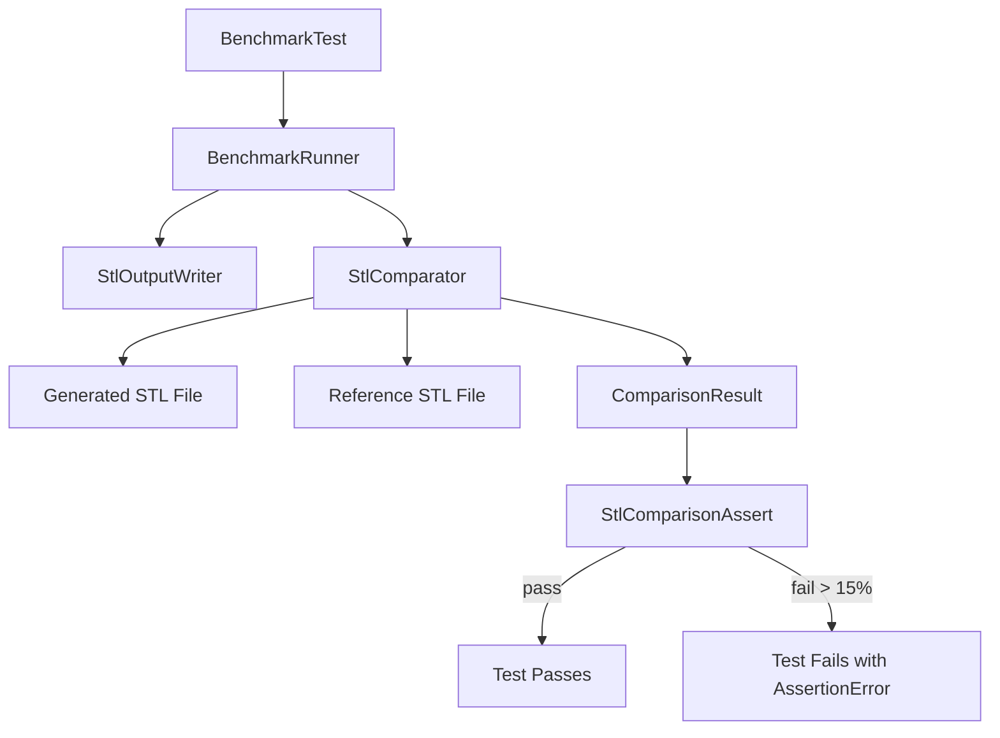
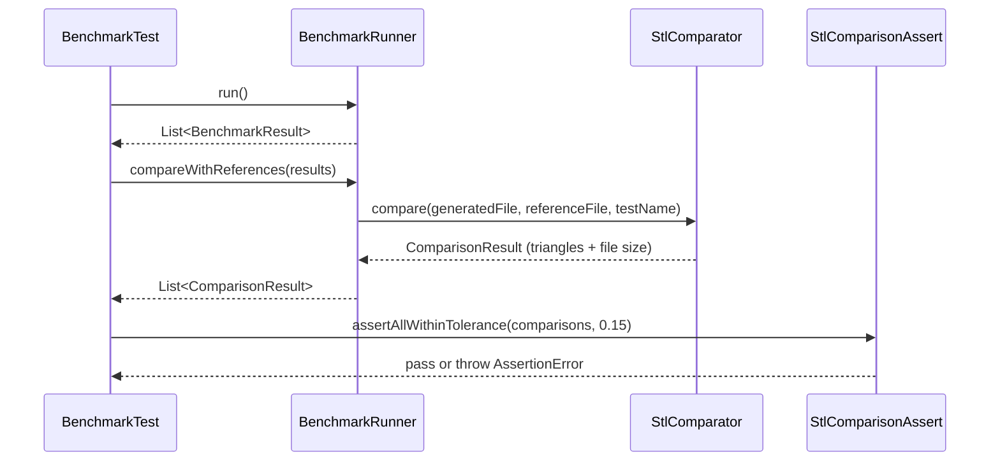

# Design Document: STL Comparison Tests

## Overview

This feature extends the existing benchmark test runner to validate CGAL engine output by comparing generated STL files against reference STL files. The comparison checks two metrics: file size (in bytes) and triangle count. If either metric deviates from the expected reference by more than 15%, the test fails with a descriptive assertion error.

The design builds on the existing `StlComparator` and `BenchmarkRunner.compareWithReferences()` infrastructure, enhancing it to include file size comparison and a configurable tolerance threshold that triggers test failures rather than merely logging differences.

## Architecture



## Sequence Diagrams

### Main Comparison Flow



## Components and Interfaces

### Component 1: StlComparator (Enhanced)

**Purpose**: Reads and compares binary STL files, returning metrics for both triangle count and file size.

**Interface**:
```kotlin
object StlComparator {

    data class ComparisonResult(
        val testName: String,
        val generatedTriangles: Int,
        val expectedTriangles: Int,
        val generatedFileSize: Long,
        val expectedFileSize: Long,
        val trianglesMatch: Boolean,
        val fileSizeMatch: Boolean
    ) {
        val triangleRatio: Double
        val trianglePercentDiff: Double
        val fileSizeRatio: Double
        val fileSizePercentDiff: Double
        val withinTolerance: Boolean  // both metrics within threshold
    }

    fun readTriangleCount(file: File): Int?
    fun compare(
        generatedFile: File,
        referenceFile: File,
        testName: String,
        tolerance: Double = 0.15
    ): ComparisonResult?
}
```

**Responsibilities**:
- Read triangle count from binary STL header (existing)
- Read file size from the filesystem (new)
- Compute percent difference for both metrics
- Determine if differences fall within the tolerance threshold

### Component 2: StlComparisonAssert

**Purpose**: Provides JUnit assertion methods that fail the test when STL comparison results exceed the tolerance.

**Interface**:
```kotlin
object StlComparisonAssert {

    fun assertAllWithinTolerance(
        comparisons: List<StlComparator.ComparisonResult>,
        tolerance: Double = 0.15
    )

    fun assertWithinTolerance(
        result: StlComparator.ComparisonResult,
        tolerance: Double = 0.15
    )
}
```

**Responsibilities**:
- Iterate over comparison results and assert each is within tolerance
- Produce clear failure messages indicating which metric failed, expected vs actual, and percent difference
- Aggregate all failures into a single assertion message for batch reporting

### Component 3: BenchmarkRunner (Modified)

**Purpose**: Orchestrates benchmark execution and STL comparison (existing, minor modification).

**Interface change**: The existing `compareWithReferences()` already returns `List<ComparisonResult>`. The enhanced `ComparisonResult` includes file size data. No signature change needed.

### Component 4: BenchmarkTest (Modified)

**Purpose**: The JUnit test that runs all benchmarks and asserts STL comparison results.

**Change**: After calling `compareWithReferences()`, call `StlComparisonAssert.assertAllWithinTolerance()` to make the test fail on deviation > 15%.

## Data Models

### ComparisonResult (Enhanced)

```kotlin
data class ComparisonResult(
    val testName: String,
    val generatedTriangles: Int,
    val expectedTriangles: Int,
    val generatedFileSize: Long,
    val expectedFileSize: Long,
    val trianglesMatch: Boolean,
    val fileSizeMatch: Boolean
) {
    val triangleRatio: Double
        get() = if (expectedTriangles > 0) generatedTriangles.toDouble() / expectedTriangles else 0.0

    val trianglePercentDiff: Double
        get() = if (expectedTriangles > 0)
            ((generatedTriangles - expectedTriangles).toDouble() / expectedTriangles * 100.0)
        else 0.0

    val fileSizeRatio: Double
        get() = if (expectedFileSize > 0) generatedFileSize.toDouble() / expectedFileSize else 0.0

    val fileSizePercentDiff: Double
        get() = if (expectedFileSize > 0)
            ((generatedFileSize - expectedFileSize).toDouble() / expectedFileSize * 100.0)
        else 0.0

    fun withinTolerance(tolerance: Double = 0.15): Boolean {
        val triangleOk = expectedTriangles == 0 ||
            kotlin.math.abs(trianglePercentDiff) <= tolerance * 100.0
        val sizeOk = expectedFileSize == 0L ||
            kotlin.math.abs(fileSizePercentDiff) <= tolerance * 100.0
        return triangleOk && sizeOk
    }
}
```

**Validation Rules**:
- `generatedTriangles` and `expectedTriangles` must be non-negative
- `generatedFileSize` and `expectedFileSize` must be non-negative
- Tolerance is expressed as a fraction (0.15 = 15%)
- Division-by-zero guarded: if expected is 0, comparison is skipped (passes)

## Algorithmic Pseudocode

### STL File Comparison Algorithm

```kotlin
fun compare(generatedFile: File, referenceFile: File, testName: String, tolerance: Double): ComparisonResult? {
    // Precondition: referenceFile exists; generatedFile exists
    if (!referenceFile.exists()) return null
    if (!generatedFile.exists()) return null

    val genTriangles = readTriangleCount(generatedFile) ?: return null
    val expTriangles = readTriangleCount(referenceFile) ?: return null
    val genSize = generatedFile.length()
    val expSize = referenceFile.length()

    val trianglePercentDiff = if (expTriangles > 0)
        abs((genTriangles - expTriangles).toDouble() / expTriangles * 100.0) else 0.0
    val sizePercentDiff = if (expSize > 0)
        abs((genSize - expSize).toDouble() / expSize * 100.0) else 0.0

    return ComparisonResult(
        testName = testName,
        generatedTriangles = genTriangles,
        expectedTriangles = expTriangles,
        generatedFileSize = genSize,
        expectedFileSize = expSize,
        trianglesMatch = trianglePercentDiff <= tolerance * 100.0,
        fileSizeMatch = sizePercentDiff <= tolerance * 100.0
    )
}
```

**Preconditions:**
- `generatedFile` path points to a valid binary STL file (≥ 84 bytes)
- `referenceFile` path points to a valid binary STL file (≥ 84 bytes)
- `tolerance` is in range [0.0, 1.0]

**Postconditions:**
- Returns `null` if either file doesn't exist or is unreadable
- Returns `ComparisonResult` with accurate metrics otherwise
- `trianglesMatch` is `true` iff `|percentDiff| <= tolerance * 100`
- `fileSizeMatch` is `true` iff `|percentDiff| <= tolerance * 100`

### Assertion Algorithm

```kotlin
fun assertAllWithinTolerance(comparisons: List<ComparisonResult>, tolerance: Double) {
    // Precondition: comparisons is non-empty
    val failures = mutableListOf<String>()

    for (result in comparisons) {
        if (!result.withinTolerance(tolerance)) {
            val msg = buildString {
                append("${result.testName}: ")
                if (!result.trianglesMatch) {
                    append("triangles ${result.generatedTriangles} vs ${result.expectedTriangles} ")
                    append("(${formatPercent(result.trianglePercentDiff)} diff) ")
                }
                if (!result.fileSizeMatch) {
                    append("file size ${result.generatedFileSize} vs ${result.expectedFileSize} bytes ")
                    append("(${formatPercent(result.fileSizePercentDiff)} diff) ")
                }
                append("exceeds ${(tolerance * 100).toInt()}% tolerance")
            }
            failures.add(msg)
        }
    }

    if (failures.isNotEmpty()) {
        fail("STL comparison failed for ${failures.size} test(s):\n${failures.joinToString("\n")}")
    }
}
```

**Preconditions:**
- `comparisons` list is not empty
- `tolerance` is in range [0.0, 1.0]

**Postconditions:**
- If all comparisons are within tolerance, returns normally (no exception)
- If any comparison exceeds tolerance, throws `AssertionError` with all failures listed
- Never partially reports — all comparisons are checked before failing

**Loop Invariants:**
- `failures` contains messages only for comparisons already checked that exceeded tolerance

## Key Functions with Formal Specifications

### Function: readTriangleCount

```kotlin
fun readTriangleCount(file: File): Int?
```

**Preconditions:**
- `file` is a non-null `File` reference

**Postconditions:**
- Returns `null` if file doesn't exist, is < 84 bytes, or I/O error occurs
- Returns non-negative `Int` representing triangle count from bytes 80-83 (little-endian uint32)
- No side effects

### Function: withinTolerance

```kotlin
fun ComparisonResult.withinTolerance(tolerance: Double): Boolean
```

**Preconditions:**
- `tolerance` is in range [0.0, 1.0]

**Postconditions:**
- Returns `true` if and only if both `|trianglePercentDiff| <= tolerance * 100` AND `|fileSizePercentDiff| <= tolerance * 100`
- If `expectedTriangles == 0`, triangle check is skipped (returns true for that metric)
- If `expectedFileSize == 0`, file size check is skipped (returns true for that metric)

### Function: assertAllWithinTolerance

```kotlin
fun assertAllWithinTolerance(comparisons: List<ComparisonResult>, tolerance: Double = 0.15)
```

**Preconditions:**
- `comparisons` is a non-empty list of `ComparisonResult`
- `tolerance` is in range [0.0, 1.0]

**Postconditions:**
- If all results satisfy `withinTolerance(tolerance)`, method returns normally
- Otherwise, throws `AssertionError` listing all failing tests and their metrics
- Failure message includes test name, actual vs expected values, percent difference, and threshold

## Example Usage

```kotlin
// In BenchmarkTest
@Test
fun `run all test cases and assert STL comparisons within 15%`() {
    val runner = BenchmarkRunner(engines, testCases, stlOutputDir)
    val results = runner.run()

    // Compare generated STL against references
    val comparisons = runner.compareWithReferences(results)

    // Print summary (informational)
    TimingSummaryFormatter.format(results, comparisons)

    // Assert all comparisons are within 15% tolerance — fails test if exceeded
    if (comparisons.isNotEmpty()) {
        StlComparisonAssert.assertAllWithinTolerance(comparisons, tolerance = 0.15)
    }
}
```

```kotlin
// Direct usage of StlComparator
val result = StlComparator.compare(
    generatedFile = File("build/benchmark-stl/cgal/custom_sun.stl"),
    referenceFile = File("src/test/resources/expected_results/custom_sun.stl"),
    testName = "sun"
)
if (result != null && !result.withinTolerance(0.15)) {
    println("FAIL: ${result.testName} - triangles differ by ${result.trianglePercentDiff}%")
}
```

## Correctness Properties

*A property is a characteristic or behavior that should hold true across all valid executions of a system — essentially, a formal statement about what the system should do. Properties serve as the bridge between human-readable specifications and machine-verifiable correctness guarantees.*

### Property 1: All within tolerance implies test passes

*For any* list of ComparisonResult entries where every entry satisfies withinTolerance(0.15), calling assertAllWithinTolerance SHALL return normally without throwing an exception.

**Validates: Requirements 3.1, 4.1**

### Property 2: Any exceeding tolerance implies test fails

*For any* list of ComparisonResult entries where at least one entry does not satisfy withinTolerance(0.15), calling assertAllWithinTolerance SHALL throw an AssertionError.

**Validates: Requirements 3.2, 4.2**

### Property 3: Triangle count reading correctness

*For any* valid binary STL byte array (≥ 84 bytes) with a known triangle count embedded at bytes 80–83 in little-endian format, readTriangleCount SHALL return that exact integer value.

**Validates: Requirements 1.1**

### Property 4: Percent difference formula correctness

*For any* ComparisonResult with positive expectedTriangles and positive expectedFileSize, the trianglePercentDiff SHALL equal (generatedTriangles − expectedTriangles) / expectedTriangles × 100, and the fileSizePercentDiff SHALL equal (generatedFileSize − expectedFileSize) / expectedFileSize × 100.

**Validates: Requirements 2.4, 2.5**

### Property 5: Zero-expected values never cause false failure

*For any* ComparisonResult where expectedTriangles equals zero, the triangle metric SHALL be treated as passing regardless of generatedTriangles. Likewise, *for any* ComparisonResult where expectedFileSize equals zero, the file size metric SHALL be treated as passing regardless of generatedFileSize.

**Validates: Requirements 3.3, 3.4, 6.3, 6.4**

### Property 6: Tolerance boundary is inclusive

*For any* positive expected value, if the generated value produces an absolute percent difference of exactly tolerance × 100 (e.g., exactly 15.0%), withinTolerance SHALL return true.

**Validates: Requirements 3.5**

### Property 7: Assertion error message contains all failing test names

*For any* list of ComparisonResult entries containing multiple entries that exceed tolerance, the AssertionError message SHALL contain the testName of every failing entry.

**Validates: Requirements 4.3**

## Error Handling

### Error Scenario 1: Reference File Missing

**Condition**: No reference STL file exists for a test case
**Response**: `compare()` returns `null`, test case is skipped in comparison (no failure)
**Recovery**: User must generate reference files; missing references are logged as informational

### Error Scenario 2: Generated STL File Missing or Corrupt

**Condition**: Engine produced SUCCESS status but STL file is missing or < 84 bytes
**Response**: `readTriangleCount()` returns `null`, `compare()` returns `null`
**Recovery**: Test case skipped in comparison; underlying engine/write issue logged separately

### Error Scenario 3: Division by Zero (Expected = 0)

**Condition**: Reference STL has 0 triangles or 0 file size
**Response**: That metric's comparison is considered passing (skipped)
**Recovery**: None needed; this guards against degenerate reference files

## Testing Strategy

### Unit Testing Approach

- Test `StlComparator.compare()` with synthetic binary STL files (varying triangle counts and sizes)
- Test `StlComparisonAssert.assertAllWithinTolerance()` with results at/around the 15% boundary
- Test edge cases: exactly 15%, slightly above, missing files, zero-expected values

### Property-Based Testing Approach

**Test Library**: jqwik (already used in the project)

- For any generated triangle count within 15% of expected, `withinTolerance(0.15)` returns `true`
- For any generated triangle count outside 15% of expected, `withinTolerance(0.15)` returns `false`
- `assertAllWithinTolerance` throws iff at least one result exceeds tolerance
- Percent difference calculation is symmetric with respect to sign (absolute value used for threshold check)

### Integration Testing Approach

- Run `BenchmarkTest` with real CGAL engine and reference files in `expected_results/`
- Verify that custom test cases (sun, controll_rose, tower) produce STL within tolerance
- Use the existing `BenchmarkTest` as the integration point

## Performance Considerations

- File size is read via `File.length()` which is a filesystem metadata call (no I/O of file contents)
- Triangle count reads only 84 bytes from each STL file (header + count)
- Comparison overhead is negligible relative to CGAL computation time

## Dependencies

- JUnit 5 (existing) — for assertions and test execution
- jqwik (existing) — for property-based tests
- Java NIO / `java.io.File` (existing) — for file I/O
- No new external dependencies required
