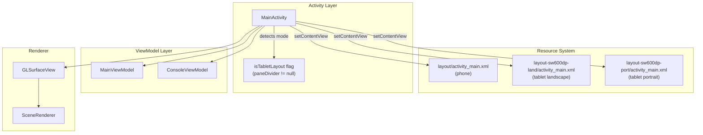

# Design Document: Tablet Layout

## Overview

This design describes how the Pncad (OpenSCAD Viewer) app adapts its single-activity UI to tablet devices (smallest width ≥ 600dp) by providing a side-by-side split pane layout. The phone layout remains unchanged — a ViewFlipper + TabLayout for switching between Code and Preview. On tablets, both panes are visible simultaneously, removing the need for tab switching.

The approach leverages Android's resource qualifier system (`layout-sw600dp-land`, `layout-sw600dp-port`) so the framework handles layout selection at inflation time. MainActivity detects which layout was inflated by checking for the presence of a sentinel view and conditionally sets up either the phone or tablet UI path. A new `MainViewModel` preserves all transient state (editor content, camera, mesh) across configuration changes.

## Architecture



### Layout Selection Strategy

Android's resource qualifier system resolves the correct `activity_main.xml` at inflation time:

| Qualifier Directory | Device | Orientation | Pane Arrangement |
|---|---|---|---|
| `layout/` | Phone (sw < 600dp) | Any | Single pane + ViewFlipper/TabLayout |
| `layout-sw600dp-land/` | Tablet (sw ≥ 600dp) | Landscape | Horizontal split (left/right) |
| `layout-sw600dp-port/` | Tablet (sw ≥ 600dp) | Portrait | Vertical split (top/bottom) |

### Detection Mechanism

After `setContentView()`, MainActivity checks for the existence of a `paneDivider` view (`@+id/paneDivider`). If present, the inflated layout is the tablet split pane. This is simpler and more reliable than querying `Configuration.smallestScreenWidthDp` at runtime, because it directly reflects what the framework resolved.

```kotlin
private val isTabletLayout: Boolean by lazy {
    findViewById<View>(R.id.paneDivider) != null
}
```

### Fallback Logic

After layout inflation, if the available width for either pane falls below 200dp, MainActivity falls back to the phone-style single-pane behavior by hiding one pane and showing the TabLayout. This is a defensive measure for edge cases (e.g., multi-window on a 600dp device).

```kotlin
fun shouldFallbackToSinglePane(availableWidthDp: Float, dividerWidthDp: Float): Boolean {
    val paneWidth = (availableWidthDp - dividerWidthDp) / 2f
    return paneWidth < 200f
}
```

## Components and Interfaces

### 1. MainViewModel (new)

A ViewModel that survives configuration changes and holds all transient screen state.

```kotlin
class MainViewModel : ViewModel() {
    // Editor state
    var editorText: String = ""
    var cursorPosition: Int = 0
    var currentFileName: String = ""
    var statusBarText: String = ""

    // Renderer state
    var meshVertices: FloatArray? = null
    var meshNormals: FloatArray? = null
    var meshColors: FloatArray? = null
    var triangleCount: Int = 0

    // Camera state
    var cameraRotX: Float = 30f
    var cameraRotY: Float = -45f
    var cameraDistance: Float = 10f
    var cameraPanX: Float = 0f
    var cameraPanY: Float = 0f

    // Computation state
    var isComputing: Boolean = false
}
```

### 2. Modified MainActivity

Key changes to MainActivity:

- **Add `MainViewModel`** via `ViewModelProvider`
- **Add `isTabletLayout` detection** after `setContentView()`
- **Conditional setup**: skip TabLayout/ViewFlipper wiring on tablet; directly bind both panes
- **State save/restore**: on pause/config change, push state to MainViewModel; on create, pull state back
- **Preview action**: on tablet, skip `tabLayout.getTabAt(1)?.select()` since both panes are always visible

### 3. Layout XML Files

#### layout-sw600dp-land/activity_main.xml (Tablet Landscape)

Horizontal split: Code left, Preview right, 50/50 weight with a vertical divider.

Key structural differences from phone layout:
- No `TabLayout`
- No `ViewFlipper`
- Code editor pane and preview pane are siblings in a horizontal `LinearLayout` with `layout_weight="1"` each
- A `View` with id `paneDivider` separates them (width: 2dp)
- Same view IDs (`codeEditor`, `lineNumbers`, `previewContainer`, `previewPlaceholder`, `progressBar`, etc.) used in both layouts so MainActivity code binds identically

#### layout-sw600dp-port/activity_main.xml (Tablet Portrait)

Vertical split: Code top, Preview bottom, 50/50 weight with a horizontal divider.

Same view IDs as landscape tablet layout, but arranged vertically.

### 4. View Controls Visibility Logic

The existing `updateViewControlsVisibility()` currently checks `currentTabPosition == 1`. On tablet, the preview is always visible, so the logic becomes:

```kotlin
private fun updateViewControlsVisibility() {
    val isPreviewVisible = isTabletLayout || currentTabPosition == 1
    val hasMesh = currentMesh != null
    viewControlsOverlay.visibility = if (isPreviewVisible && hasMesh) View.VISIBLE else View.GONE
}
```

## Data Models

### MainViewModel State

| Field | Type | Preserved Across | Source |
|---|---|---|---|
| `editorText` | `String` | Config change | `codeEditor.text` |
| `cursorPosition` | `Int` | Config change | `codeEditor.selectionStart` |
| `currentFileName` | `String` | Config change | Local variable |
| `statusBarText` | `String` | Config change | `statusBar.text` |
| `meshVertices` | `FloatArray?` | Config change | `MeshResult.vertices` |
| `meshNormals` | `FloatArray?` | Config change | `MeshResult.normals` |
| `meshColors` | `FloatArray?` | Config change | `MeshResult.colors` |
| `triangleCount` | `Int` | Config change | `MeshResult.triangleCount` |
| `cameraRotX` | `Float` | Config change | `SceneRenderer.cameraRotX` |
| `cameraRotY` | `Float` | Config change | `SceneRenderer.cameraRotY` |
| `cameraDistance` | `Float` | Config change | `SceneRenderer.cameraDistance` |
| `cameraPanX` | `Float` | Config change | `SceneRenderer.cameraPanX` |
| `cameraPanY` | `Float` | Config change | `SceneRenderer.cameraPanY` |
| `isComputing` | `Boolean` | Config change | Coroutine job state |

### Layout Decision Function

```
Input:  availableWidthDp: Float, dividerWidthDp: Float
Output: Boolean (true = fallback to single pane)
Rule:   (availableWidthDp - dividerWidthDp) / 2 < 200
```

## Correctness Properties

*A property is a characteristic or behavior that should hold true across all valid executions of a system — essentially, a formal statement about what the system should do. Properties serve as the bridge between human-readable specifications and machine-verifiable correctness guarantees.*

### Property 1: Layout fallback decision correctness

*For any* available screen width (in dp) and divider width, the `shouldFallbackToSinglePane` function SHALL return `true` if and only if the computed pane width `(availableWidth - dividerWidth) / 2` is less than 200dp.

**Validates: Requirements 1.5, 2.5**

### Property 2: UI state preservation round-trip

*For any* valid editor state (arbitrary non-null text content, cursor position within text bounds, arbitrary file name string, arbitrary status bar text), storing the state into `MainViewModel` and then restoring it SHALL produce values identical to the originals.

**Validates: Requirements 6.1, 6.2, 1.4, 7.3**

### Property 3: Renderer state preservation round-trip

*For any* valid mesh data (non-empty float arrays where vertices/normals/colors lengths are multiples of 3/3/4 respectively) and any valid camera parameters (finite float values for rotX, rotY, distance > 0, panX, panY), storing into `MainViewModel` and retrieving SHALL produce byte-for-byte identical arrays and equal float values.

**Validates: Requirements 6.3, 6.4, 1.4, 7.3**

### Property 4: View controls visibility logic

*For any* combination of (`isTabletLayout`: Boolean, `currentTabPosition`: Int in {0,1}, `hasMesh`: Boolean), the view controls overlay SHALL be visible if and only if (`isTabletLayout` OR `currentTabPosition == 1`) AND `hasMesh` is true.

**Validates: Requirements 4.2**

## Error Handling

| Scenario | Behavior |
|---|---|
| Tablet layout inflated but width too narrow (multi-window edge case) | Fall back to single-pane mode; hide one pane, show TabLayout |
| Configuration change during active computation | Cancel computation via `engineManager.currentEngine.cancel()`, set status to "Computation cancelled" |
| GLSurfaceView lost during config change | Recreate GLSurfaceView in `onCreate`, restore mesh data from MainViewModel, re-apply camera state |
| ViewModel returns null mesh (fresh launch) | Show preview placeholder text; no GLSurfaceView created until first render |
| Cursor position exceeds restored text length | Clamp cursor to `text.length` to prevent IndexOutOfBoundsException |

## Testing Strategy

### Property-Based Tests (jqwik)

The project already uses `net.jqwik:jqwik:1.8.4`. Each property test runs a minimum of 100 iterations.

| Property | Test Class | What's Generated |
|---|---|---|
| Property 1: Layout fallback | `LayoutDecisionPropertyTest` | Random screen widths (0–2000dp), divider widths (0–10dp) |
| Property 2: UI state round-trip | `MainViewModelStatePropertyTest` | Random strings (0–10000 chars), random cursor positions, random file names |
| Property 3: Renderer state round-trip | `MainViewModelRendererPropertyTest` | Random FloatArrays (valid mesh sizes), random camera floats |
| Property 4: View controls visibility | `ViewControlsVisibilityPropertyTest` | All boolean/int combinations (exhaustive for small domain) |

Each property test is tagged with:
```
// Feature: tablet-layout, Property {N}: {property_text}
```

Minimum 100 iterations per property.

### Unit Tests (JUnit 5)

- Verify `isTabletLayout` detection returns correct value when `paneDivider` is present vs absent
- Verify `generatePreview()` on tablet mode does not attempt tab switching
- Verify computation cancellation on config change sets correct status text
- Verify cursor position clamping when restored text is shorter than stored cursor

### Integration Tests

- Verify correct layout XML is inflated on 600dp+ device (Robolectric with qualifiers)
- Verify correct layout XML is inflated on < 600dp device
- Verify tablet landscape pane arrangement (horizontal)
- Verify tablet portrait pane arrangement (vertical)
- Verify touch events in preview pane don't propagate to code editor
- Verify button bar is present and spans full width in tablet mode

### What's NOT Property-Tested

- XML layout structure (static, verified by integration tests)
- Android framework resource qualifier resolution (framework behavior)
- Touch event propagation (requires instrumented UI tests)
- GLSurfaceView rendering correctness (OpenGL, not unit-testable)
- Timing requirements (1-second layout transition — inherent to framework)
